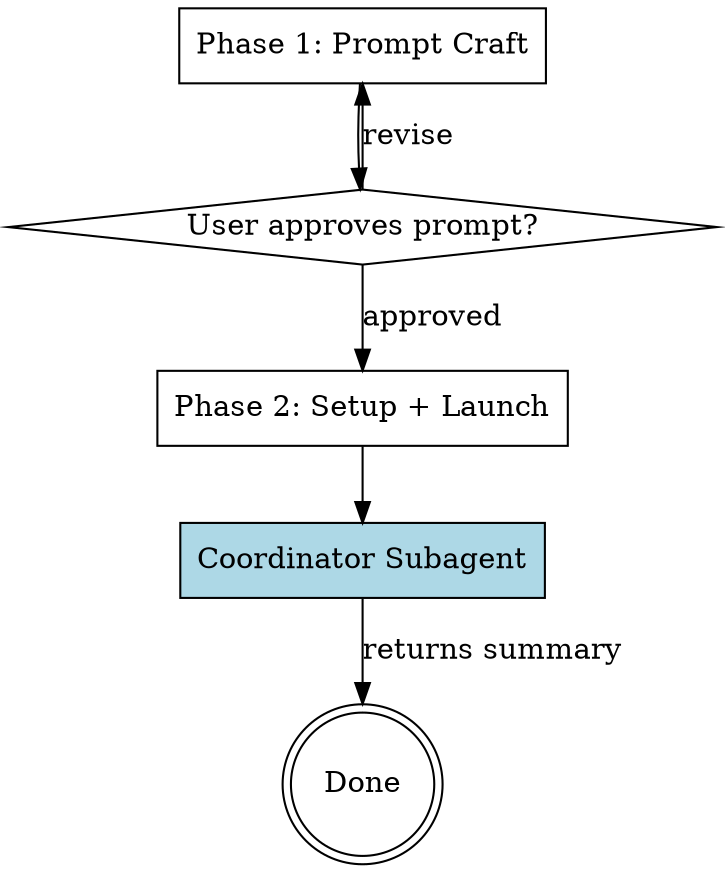

# Giga Research

Orchestrate deep research across Claude, OpenAI, and Gemini in parallel. Craft a research prompt conversationally, then launch a single background coordinator that dispatches providers, validates citations, and synthesizes a unified report — all without polluting the main conversation.

## When to Use This Skill

Activate when the user:
- Asks to "research [topic]" or "do deep research on [topic]"
- Wants a comprehensive report synthesized from multiple AI sources
- Needs cross-validation or fact-checking of claims across providers
- Asks to "compare what Claude, OpenAI, and Gemini say about [topic]"
- Wants citation-validated research with source verification
- Mentions "research report", "multi-provider research", or "deep research"

## What You Get

A timestamped research session containing:
- **report.md** — Unified report with consensus/majority/contested/unique tagging per claim
- **comparison-matrix.md** — Side-by-side topic coverage across providers
- **validation-log.md** — Citation audit trail (if validation depth > 0)
- **raw/\*.md** — Original report from each provider for reference
- **meta.json** — Timing, token usage, and session metadata

## Providers

| Provider | Model | Method | Typical Time |
|----------|-------|--------|-------------|
| Claude | claude-sonnet-4-5 | Messages API + web search | ~1-2 min |
| OpenAI | o3-deep-research | Responses API (background polling) | ~5-10 min |
| Gemini | deep-research-pro | Interactions API (background polling) | ~5-10 min |

Works with any subset (minimum 1). Missing providers can use manual fallback (paste prompt into web UI, save result to session directory).

## Example Invocations

**Basic:**
> "Research the current state of quantum computing — what's practical vs. theoretical"

**Targeted:**
> "Do deep research on ransomware threat actors in 2025-2026. Focus on tactics, key groups, and defense strategies. Use all three providers."

**Comparison-focused:**
> "Compare what different AI research providers say about the future of nuclear fusion energy. Highlight where they agree and disagree."

---

## Setup

**`SKILL_ROOT`** is the directory containing this SKILL.md file. All CLI commands use `uv run --project <SKILL_ROOT>` so they work from any working directory and auto-install dependencies on first run.

**API keys required** (at least 1):
- `ANTHROPIC_API_KEY` — for Claude
- `OPENAI_API_KEY` — for OpenAI
- `GEMINI_API_KEY` — for Gemini (uses Deep Research via Interactions API)

Keys can be set as environment variables or in a `.env` file at `<SKILL_ROOT>/.env`:

```bash
cp <SKILL_ROOT>/.env.example <SKILL_ROOT>/.env
# Edit .env and fill in your API keys
```

Environment variables, if already set, take precedence over the `.env` file.

**Verify installation and API keys:**

```bash
uv run --project <SKILL_ROOT> giga-research check-providers
```

This both verifies that dependencies are installed (auto-installing if needed) and reports which API keys are configured. The first run takes 10-30s to install dependencies; subsequent runs are instant.

## Workflow



---

## Phase 1: Prompt Craft

**Goal:** Build a well-structured research prompt through conversation.

1. Ask the user about their research topic. One question at a time.
2. Clarify: scope boundaries, specific questions to answer, desired depth, output expectations.
3. Build a structured prompt incorporating all of the above.
4. Present the full prompt to the user for approval.
5. **GATE:** Do NOT proceed until the user explicitly approves the prompt.

The prompt should follow this structure:
```
# Research Task: [Topic]

## Scope
[What to include and exclude]

## Key Questions
1. [Specific question]
2. [Specific question]
...

## Depth & Focus
[How deep to go, what to prioritize]

## Output Expectations
[Structure, length, citation requirements]
```

---

## Phase 2: Setup + Launch

After the user approves the prompt:

1. Run:
   ```bash
   uv run --project <SKILL_ROOT> giga-research check-providers
   ```
2. Report to the user which providers are available and which are missing.
3. For each missing provider, ask: **skip** or **manual fallback**?
4. Create the session directory:
   ```bash
   uv run --project <SKILL_ROOT> giga-research create-session --topic "<topic-slug>"
   ```
   This creates `./research-output/<timestamp>-<slug>/` in the **current working directory** (i.e., where the main agent is running) and prints the absolute session path.
5. Save the approved prompt to `<session-dir>/prompt.md`.
6. Ask the user for citation validation depth (0-3):
   - **0** — No validation (default, fastest)
   - **1** — URL liveness check
   - **2** — Content verification (checks if cited claim exists in source)
   - **3** — Full verification + find replacements for dead citations
7. **Launch the coordinator subagent** as a single background Task using the prompt template below.
8. Tell the user: "Research is running in the background. I'll report back when it's done."

**For manual fallback providers** (if any):
1. Before launching the coordinator, tell the user: "Please paste the prompt from `<session-dir>/prompt.md` into [Provider]'s deep research interface."
2. Ask them to save the result to `<session-dir>/raw/<provider>.md`
3. Wait for confirmation, then launch the coordinator.

---

## Coordinator Subagent Instructions

**Launch ONE background subagent** using the Task tool with the following prompt template. Replace `<SKILL_ROOT>`, `<session-dir>` and `<depth>` with actual values.

```
You are a research coordinator. Your job is to run the research pipeline, then synthesize a unified report.

## Step 1: Run the pipeline

Run this command:
```bash
uv run --project <SKILL_ROOT> giga-research orchestrate \
    --session-dir <session-dir> \
    --depth <depth>
```

Parse the JSON output. It will contain:
- providers_used: which providers returned results
- providers_failed: which providers failed (with error messages)
- citation_count: total citations found
- citations_validated: how many were validated
- topics_identified: list of topics from cross-report analysis

If all providers failed, report this back and stop.

## Step 2: Read the generated files

Read these files from <session-dir>:
- raw/<provider>.md for each provider in providers_used
- comparison-matrix.md
- validation-log.md (if depth > 0)

## Step 3: Synthesize unified report

Using the raw reports and comparison matrix, write <session-dir>/report.md with this structure:

```markdown
# [Topic] — Research Report

## Executive Summary
[2-3 paragraph synthesis of key findings]

## Methodology
Synthesized from research conducted via: [list providers used].
Citation validation depth: [N].

## Findings
### [Topic 1]
[Synthesized findings. Tag sources: [Claude, OpenAI], [Gemini only], etc.]
[Classify each claim:]
- **Consensus** — all sources agree (high confidence)
- **Majority** — 2 of 3 agree (note the dissent)
- **Contested** — sources disagree (present all perspectives)
- **Unique** — only one source covers it (note single-source)

### [Topic 2]
...

## Areas of Disagreement
[Explicit section for contested claims with all perspectives]

## Gaps & Limitations
[What none of the sources covered adequately]

## References
[Deduplicated, validated citation list]
```

## Step 4: Return summary

Report back with:
1. Which providers succeeded/failed
2. Number of topics identified
3. Number of citations found and validated
4. Any notable findings (high disagreement, dead citations, unique insights)
5. The path to report.md as the primary deliverable
6. Paths to all output files in the session directory
```

---

## Error Handling

- If a provider API call fails: the pipeline isolates the failure and continues with remaining providers. The coordinator reports which providers failed.
- If all providers fail: the coordinator reports the errors. The parent agent should inform the user and suggest manual fallback.
- Never silently skip a failure. Always inform the user and offer a path forward.
