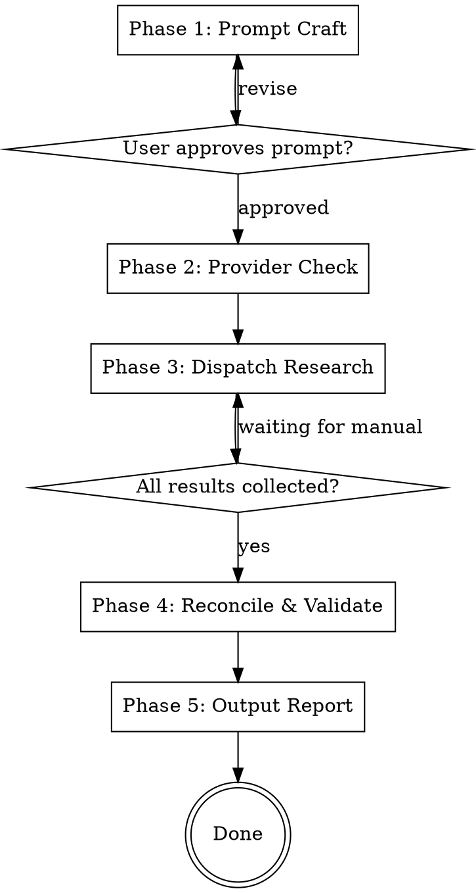

# Giga Research

## Overview

Orchestrate deep research across Claude, OpenAI, and Gemini in parallel. Craft a research prompt conversationally, dispatch it to all available providers, then reconcile the results into one authoritative report with citation validation.

## Prerequisites

This skill requires the `giga_research` Python package. Before starting:

```bash
cd <path-to-giga-research-skill>
uv sync
```

API keys are loaded automatically from a `.env` file in the skill folder root:

```bash
cp .env.example .env
# Edit .env and fill in your API keys
```

Supported keys:
- `ANTHROPIC_API_KEY` — for Claude
- `OPENAI_API_KEY` — for OpenAI
- `GEMINI_API_KEY` — for Gemini (uses Deep Research via Interactions API)

The skill works with any subset of these (minimum 1). Environment variables, if already set, take precedence over the `.env` file.

## Workflow



---

## Phase 1: Prompt Craft

**Goal:** Build a well-structured research prompt through conversation.

1. Ask the user about their research topic. One question at a time.
2. Clarify: scope boundaries, specific questions to answer, desired depth, output expectations.
3. Build a structured prompt incorporating all of the above.
4. Present the full prompt to the user for approval.
5. **GATE:** Do NOT proceed until the user explicitly approves the prompt.

The prompt should follow this structure:
```
# Research Task: [Topic]

## Scope
[What to include and exclude]

## Key Questions
1. [Specific question]
2. [Specific question]
...

## Depth & Focus
[How deep to go, what to prioritize]

## Output Expectations
[Structure, length, citation requirements]
```

---

## Phase 2: Provider Check

1. Run: `uv run python -m giga_research.cli check-providers`
2. Report to the user which providers are available and which are missing.
3. For each missing provider, ask: **skip** or **manual fallback**?
4. Create the session directory:
   ```bash
   uv run python -c "
   from giga_research.research.collector import create_session_dir
   from pathlib import Path
   d = create_session_dir(Path('research-output'), '<topic-slug>')
   print(d)
   "
   ```
5. Save the approved prompt to `<session-dir>/prompt.md`.

---

## Phase 3: Dispatch Research

**For each available API provider**, launch a subagent **in parallel** using the Task tool:

Each subagent should run:
```bash
uv run python -m giga_research.cli research \
    --provider <provider> \
    --prompt-file <session-dir>/prompt.md \
    --session-dir <session-dir>
```

Launch ALL provider subagents in a single message (parallel Task calls).

**Note on Gemini:** The Gemini deep research agent runs asynchronously via the Interactions API. The CLI handles the polling loop internally. Expect Gemini to take several minutes.

**For manual fallback providers:**
1. Tell the user: "Please paste the prompt from `<session-dir>/prompt.md` into [Provider]'s deep research interface."
2. Ask them to save the result to `<session-dir>/raw/<provider>.md`
3. Wait for confirmation before proceeding.

**GATE:** All results (API + manual) must be present in `<session-dir>/raw/` before proceeding.

---

## Phase 4: Reconcile & Validate

### Step 1: Citation Validation

Ask the user for validation depth:
- **0** — No validation (default, fastest)
- **1** — URL liveness check
- **2** — Content verification (checks if cited claim exists in source)
- **3** — Full verification + find replacements for dead citations

If depth > 0, run:
```bash
uv run python -m giga_research.cli validate \
    --session-dir <session-dir> \
    --depth <N>
```

### Step 2: Cross-Report Analysis

Read all reports from `<session-dir>/raw/`. For each report:
1. Identify the major topics/sections covered
2. For each shared topic, compare claims across providers
3. Classify each claim:
   - **Consensus** — all sources agree (high confidence)
   - **Majority** — 2 of 3 agree (note the dissent)
   - **Contested** — sources disagree (present all perspectives)
   - **Unique** — only one source covers it (note single-source)

### Step 3: Synthesize Unified Report

Write `<session-dir>/report.md` with this structure:

```markdown
# [Topic] — Research Report

## Executive Summary
[2-3 paragraph synthesis of key findings]

## Methodology
Synthesized from research conducted via: [list providers used].
Citation validation depth: [N].

## Findings
### [Topic 1]
[Synthesized findings. Tag sources: [Claude, OpenAI], [Gemini only], etc.]

### [Topic 2]
...

## Areas of Disagreement
[Explicit section for contested claims with all perspectives]

## Gaps & Limitations
[What none of the sources covered adequately]

## References
[Deduplicated, validated citation list]
```

---

## Phase 5: Output Report

Ensure all files are written to `<session-dir>/`:
- `report.md` — unified report (written in Step 3 above)
- `comparison-matrix.md` — topic x provider grid
- `validation-log.md` — citation audit trail (if depth > 0)
- `raw/<provider>.md` — original reports (already present)
- `prompt.md` — the research prompt (already present)
- `meta.json` — session metadata

Present the user with:
1. A summary of what was produced
2. The path to `report.md` as the primary deliverable
3. Any notable findings (high disagreement, dead citations, unique insights)

---

## Error Handling

- If a provider API call fails: log the error, offer manual fallback for that provider.
- If all providers fail: halt and explain what happened. Suggest manual approach.
- Never silently skip a failure. Always inform the user and offer a path forward.
