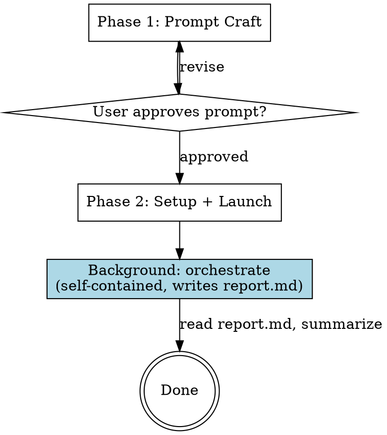

# Giga Research

Orchestrate deep research across Claude, OpenAI, and Gemini in parallel. Craft a research prompt conversationally, then run a single self-contained background pipeline (`orchestrate`) that dispatches providers, validates citations, and synthesizes a unified `report.md` — all without polluting the main conversation.

## When to Use This Skill

Activate when the user:
- Asks to "research [topic]" or "do deep research on [topic]"
- Wants a comprehensive report synthesized from multiple AI sources
- Needs cross-validation or fact-checking of claims across providers
- Asks to "compare what Claude, OpenAI, and Gemini say about [topic]"
- Wants citation-validated research with source verification
- Mentions "research report", "multi-provider research", or "deep research"

## What You Get

A timestamped research session containing:
- **report.md** — Unified report with consensus/majority/contested/unique tagging per claim
- **comparison-matrix.md** — Side-by-side topic coverage across providers
- **validation-log.md** — Citation audit trail (if validation depth > 0)
- **raw/\*.md** — Original report from each provider for reference
- **meta.json** — Timing, token usage, and session metadata

## Providers

| Provider | Model | Method | Typical Time |
|----------|-------|--------|-------------|
| Claude | claude-sonnet-4-6 | Messages API + web search | ~3-5 min |
| OpenAI | o3-deep-research | Responses API (background polling) | ~5-10 min |
| Gemini | deep-research-preview-04-2026 | Interactions API (background polling) | ~5-10 min |

Model/agent IDs are configurable via env (`CLAUDE_RESEARCH_MODEL`, `OPENAI_RESEARCH_MODEL`, `GEMINI_RESEARCH_AGENT`).

Works with any subset (minimum 1). Missing providers can use manual fallback (paste prompt into web UI, save result to session directory).

## Example Invocations

**Basic:**
> "Research the current state of quantum computing — what's practical vs. theoretical"

**Targeted:**
> "Do deep research on ransomware threat actors in 2025-2026. Focus on tactics, key groups, and defense strategies. Use all three providers."

**Comparison-focused:**
> "Compare what different AI research providers say about the future of nuclear fusion energy. Highlight where they agree and disagree."

---

## Setup

**`SKILL_ROOT`** is the directory containing this SKILL.md file. All CLI commands use `uv run --project <SKILL_ROOT>` so they work from any working directory and auto-install dependencies on first run.

**API keys required** (at least 1):
- `ANTHROPIC_API_KEY` — for Claude
- `OPENAI_API_KEY` — for OpenAI
- `GEMINI_API_KEY` — for Gemini (uses Deep Research via Interactions API)

Keys can be set as environment variables or in a `.env` file at `<SKILL_ROOT>/.env`:

```bash
cp <SKILL_ROOT>/.env.example <SKILL_ROOT>/.env
# Edit .env and fill in your API keys
```

Environment variables, if already set, take precedence over the `.env` file.

**Verify installation and API keys:**

```bash
uv run --project <SKILL_ROOT> giga-research check-providers
```

This both verifies that dependencies are installed (auto-installing if needed) and reports which API keys are configured. The first run takes 10-30s to install dependencies; subsequent runs are instant.

## Workflow


```dot
digraph workflow {
    rankdir=TB;
    "Phase 1: Prompt Craft" [shape=box];
    "User approves prompt?" [shape=diamond];
    "Phase 2: Setup + Launch" [shape=box];
    "Background: orchestrate\n(self-contained, writes report.md)" [shape=box, style=filled, fillcolor=lightblue];
    "Done" [shape=doublecircle];

    "Phase 1: Prompt Craft" -> "User approves prompt?";
    "User approves prompt?" -> "Phase 1: Prompt Craft" [label="revise"];
    "User approves prompt?" -> "Phase 2: Setup + Launch" [label="approved"];
    "Phase 2: Setup + Launch" -> "Background: orchestrate\n(self-contained, writes report.md)";
    "Background: orchestrate\n(self-contained, writes report.md)" -> "Done" [label="read report.md, summarize"];
}
```

---

## Phase 1: Prompt Craft

**Goal:** Build a well-structured research prompt through conversation.

1. Ask the user about their research topic. One question at a time.
2. Clarify: scope boundaries, specific questions to answer, desired depth, output expectations.
3. Build a structured prompt incorporating all of the above.
4. Present the full prompt to the user for approval.
5. **GATE:** Do NOT proceed until the user explicitly approves the prompt.

The prompt should follow this structure:
```
# Research Task: [Topic]

## Scope
[What to include and exclude]

## Key Questions
1. [Specific question]
2. [Specific question]
...

## Depth & Focus
[How deep to go, what to prioritize]

## Output Expectations
[Structure, length, citation requirements]
```

---

## Phase 2: Setup + Launch

After the user approves the prompt:

1. Run:
   ```bash
   uv run --project <SKILL_ROOT> giga-research check-providers
   ```
2. Report to the user which providers are available and which are missing.
3. For each missing provider, ask: **skip** or **manual fallback**?
4. Create the session directory:
   ```bash
   uv run --project <SKILL_ROOT> giga-research create-session --topic "<topic-slug>"
   ```
   This creates `./research-output/<timestamp>-<slug>/` in the **current working directory** (i.e., where the main agent is running) and prints the absolute session path.
5. Save the approved prompt to `<session-dir>/prompt.md`.
6. Ask the user for citation validation depth (0-3):
   - **0** — No validation (default, fastest)
   - **1** — URL liveness check
   - **2** — Content verification (checks if cited claim exists in source)
   - **3** — Full verification + find replacements for dead citations
7. **Run the pipeline as a background command** (it is self-contained — it dispatches providers, validates citations, builds the comparison matrix, and synthesizes `report.md` itself; no coordinator subagent needed):
   ```bash
   uv run --project <SKILL_ROOT> giga-research orchestrate --session-dir <session-dir> --depth <depth>
   ```
   Launch it in the background (it runs ~5–10 min). Tell the user: "Research is running in the background. I'll report back when it's done."
8. When the command completes, read `<session-dir>/meta.json` and `<session-dir>/report.md` and report the summary (see Reporting Results below).

**For manual fallback providers** (if any):
1. Before launching the pipeline, tell the user: "Please paste the prompt from `<session-dir>/prompt.md` into [Provider]'s deep research interface."
2. Ask them to save the result to `<session-dir>/raw/<provider>.md`
3. Wait for confirmation, then launch the pipeline.

---

## Pipeline Outputs

`orchestrate` is self-contained. It writes everything into `<session-dir>`:

- `report.md` — the unified, consensus-tagged report (synthesized in-pipeline via a single Claude call). **Primary deliverable.**
- `comparison-matrix.md` — per-topic coverage across providers.
- `validation-log.md` — citation audit (statuses: alive / blocked / dead / verified / unverified).
- `raw/<provider>.{md,json}` — each provider's original report.
- `meta.json` — providers used/failed (with errors), per-provider model/tokens/latency, validation depth.

It also prints a JSON summary to stdout (`providers_used`, `providers_failed`, `citation_count`, `citations_validated`, `topics_identified`, `report_generated`).

> **report.md synthesis needs a Claude API key.** If `ANTHROPIC_API_KEY` is set (the usual case), `orchestrate` writes `report.md` itself. If it isn't, `report_generated` is `false` and `report.md` is absent — in that case, read the `raw/<provider>.md` files + `comparison-matrix.md` and synthesize `report.md` yourself (consensus/majority/contested/unique tagging; be honest about single-source coverage).

## Reporting Results

After the background run completes, read `meta.json` + `report.md` and report to the user:
1. Which providers succeeded / failed (failures + errors are in `meta.json` → `providers_failed`)
2. Topics identified, citations found and validated (per the stdout summary)
3. Notable findings (high disagreement, many blocked/dead citations, unique insights)
4. The path to `report.md` (primary deliverable) and the other output files

---

## Error Handling

- If a provider fails: the pipeline isolates it and continues with the rest. Failures and their error messages are recorded in `meta.json` → `providers_failed` — surface them; never silently skip.
- If all providers fail: no report is produced. Inform the user and suggest manual fallback.
- Rate limits are retried automatically with backoff; a persistent failure still lands in `providers_failed`.
- Never silently skip a failure. Always inform the user and offer a path forward.
