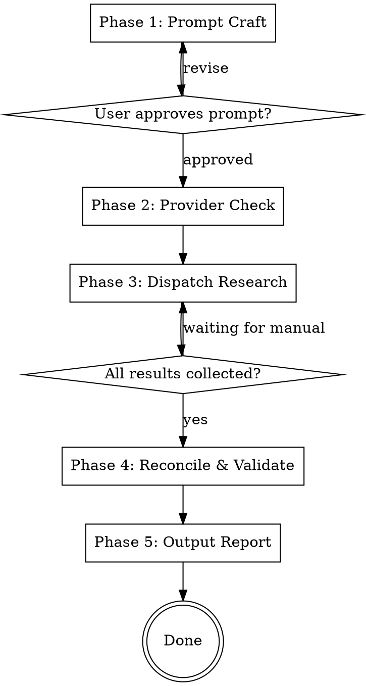

# Giga Research Skill Implementation Plan

> **For Claude:** REQUIRED SUB-SKILL: Use superpowers:executing-plans to implement this plan task-by-task.

**Goal:** Build a standalone Claude Code skill that orchestrates multi-provider deep research with a Python backend for API calls, citation validation, and report reconciliation.

**Architecture:** Monolithic SKILL.md for workflow orchestration, backed by `giga_research` Python package (src layout, uv). Subagents dispatch research in parallel via CLI commands. Graceful degradation when providers are unavailable.

**Tech Stack:** Python 3.11+, uv, Pydantic v2, anthropic SDK, openai SDK, google-genai SDK, httpx, asyncio, pytest + pytest-asyncio, ruff

---

### Task 1: Project Scaffolding

**Files:**
- Create: `pyproject.toml`
- Create: `src/giga_research/__init__.py`
- Create: `src/giga_research/py.typed`
- Create: `tests/__init__.py`
- Create: `tests/conftest.py`

**Step 1: Create `pyproject.toml`**

```toml
[project]
name = "giga-research"
version = "0.1.0"
description = "Multi-provider deep research orchestration"
requires-python = ">=3.11"
dependencies = [
    "anthropic>=0.40",
    "openai>=1.50",
    "google-genai>=1.0",
    "httpx>=0.27",
    "pydantic>=2.0",
]

[project.optional-dependencies]
dev = [
    "pytest>=8.0",
    "pytest-asyncio>=0.24",
    "respx>=0.22",
    "ruff>=0.8",
]

[build-system]
requires = ["hatchling"]
build-backend = "hatchling.build"

[tool.hatch.build.targets.wheel]
packages = ["src/giga_research"]

[tool.pytest.ini_options]
asyncio_mode = "auto"
testpaths = ["tests"]

[tool.ruff]
target-version = "py311"
src = ["src"]

[tool.ruff.lint]
select = ["E", "F", "I", "N", "UP", "B", "SIM", "TCH"]
```

**Step 2: Create package init**

`src/giga_research/__init__.py`:
```python
"""Multi-provider deep research orchestration."""

__version__ = "0.1.0"
```

`src/giga_research/py.typed` — empty marker file.

**Step 3: Create test scaffolding**

`tests/__init__.py` — empty.

`tests/conftest.py`:
```python
"""Shared test fixtures for giga_research."""

from __future__ import annotations

import pytest

from giga_research.config import Config


@pytest.fixture
def config_no_keys() -> Config:
    """Config with no API keys set."""
    return Config()


@pytest.fixture
def config_all_keys() -> Config:
    """Config with all API keys set."""
    return Config(
        claude_api_key="test-claude-key",
        openai_api_key="test-openai-key",
        gemini_api_key="test-gemini-key",
    )
```

**Step 4: Initialize uv and install deps**

Run: `cd /home/angel/Documents/code/giga-research-skill && uv sync --all-extras`
Expected: lockfile generated, deps installed

**Step 5: Verify import works**

Run: `cd /home/angel/Documents/code/giga-research-skill && uv run python -c "import giga_research; print(giga_research.__version__)"`
Expected: `0.1.0`

**Step 6: Commit**

```bash
git add pyproject.toml src/ tests/__init__.py tests/conftest.py uv.lock
git commit -m "feat: scaffold project with uv, pyproject.toml, and test config"
```

---

### Task 2: Core Types (Models)

**Files:**
- Create: `src/giga_research/models.py`
- Create: `tests/test_models.py`

**Step 1: Write the failing test**

`tests/test_models.py`:
```python
"""Tests for core Pydantic models."""

from __future__ import annotations

from giga_research.models import (
    Citation,
    ResearchResult,
    ResultMetadata,
    ValidationStatus,
)


def test_validation_status_values():
    assert ValidationStatus.UNCHECKED == "unchecked"
    assert ValidationStatus.ALIVE == "alive"
    assert ValidationStatus.DEAD == "dead"
    assert ValidationStatus.VERIFIED == "verified"
    assert ValidationStatus.HALLUCINATED == "hallucinated"
    assert ValidationStatus.REPLACED == "replaced"


def test_citation_defaults():
    c = Citation(text="Some claim")
    assert c.url is None
    assert c.title is None
    assert c.validation_status == ValidationStatus.UNCHECKED


def test_citation_with_all_fields():
    c = Citation(
        text="Claim text",
        url="https://example.com",
        title="Example",
        validation_status=ValidationStatus.VERIFIED,
    )
    assert c.url == "https://example.com"
    assert c.validation_status == ValidationStatus.VERIFIED


def test_result_metadata():
    m = ResultMetadata(model="claude-sonnet-4-5-20250929", tokens_used=1234, latency_s=12.5)
    assert m.model == "claude-sonnet-4-5-20250929"
    assert m.tokens_used == 1234
    assert m.latency_s == 12.5


def test_research_result():
    r = ResearchResult(
        provider="claude",
        content="# Research\n\nSome findings.",
        citations=[Citation(text="A claim", url="https://example.com")],
        metadata=ResultMetadata(model="claude-sonnet-4-5-20250929", tokens_used=100, latency_s=1.0),
    )
    assert r.provider == "claude"
    assert len(r.citations) == 1
    assert r.citations[0].text == "A claim"


def test_research_result_empty_citations():
    r = ResearchResult(
        provider="openai",
        content="Content",
        citations=[],
        metadata=ResultMetadata(model="gpt-4o", tokens_used=50, latency_s=0.5),
    )
    assert r.citations == []
```

**Step 2: Run test to verify it fails**

Run: `cd /home/angel/Documents/code/giga-research-skill && uv run pytest tests/test_models.py -v`
Expected: FAIL — `ModuleNotFoundError: No module named 'giga_research.models'`

**Step 3: Write the implementation**

`src/giga_research/models.py`:
```python
"""Core data models for giga_research."""

from __future__ import annotations

from enum import StrEnum

from pydantic import BaseModel


class ValidationStatus(StrEnum):
    """Status of a citation after validation."""

    UNCHECKED = "unchecked"
    ALIVE = "alive"
    DEAD = "dead"
    VERIFIED = "verified"
    HALLUCINATED = "hallucinated"
    REPLACED = "replaced"


class Citation(BaseModel):
    """A citation extracted from a research report."""

    text: str
    url: str | None = None
    title: str | None = None
    validation_status: ValidationStatus = ValidationStatus.UNCHECKED
    replacement_url: str | None = None


class ResultMetadata(BaseModel):
    """Metadata about a provider's research response."""

    model: str
    tokens_used: int
    latency_s: float


class ResearchResult(BaseModel):
    """Normalized result from a research provider."""

    provider: str
    content: str
    citations: list[Citation]
    metadata: ResultMetadata
```

**Step 4: Run test to verify it passes**

Run: `cd /home/angel/Documents/code/giga-research-skill && uv run pytest tests/test_models.py -v`
Expected: All 6 tests PASS

**Step 5: Lint**

Run: `cd /home/angel/Documents/code/giga-research-skill && uv run ruff check src/giga_research/models.py tests/test_models.py`
Expected: No errors

**Step 6: Commit**

```bash
git add src/giga_research/models.py tests/test_models.py
git commit -m "feat: add core Pydantic models (Citation, ResearchResult, ValidationStatus)"
```

---

### Task 3: Config Module

**Files:**
- Create: `src/giga_research/config.py`
- Create: `tests/test_config.py`

**Step 1: Write the failing test**

`tests/test_config.py`:
```python
"""Tests for Config loading and validation."""

from __future__ import annotations

import os
from unittest.mock import patch

from giga_research.config import Config


def test_config_defaults():
    c = Config()
    assert c.claude_api_key is None
    assert c.openai_api_key is None
    assert c.gemini_api_key is None
    assert c.request_timeout == 300
    assert c.max_retries == 3
    assert c.citation_validation_depth == 0


def test_config_available_providers_none():
    c = Config()
    assert c.available_providers == []


def test_config_available_providers_some():
    c = Config(claude_api_key="key1", gemini_api_key="key2")
    providers = c.available_providers
    assert "claude" in providers
    assert "gemini" in providers
    assert "openai" not in providers


def test_config_available_providers_all():
    c = Config(
        claude_api_key="k1",
        openai_api_key="k2",
        gemini_api_key="k3",
    )
    assert len(c.available_providers) == 3


def test_config_from_env():
    env = {
        "ANTHROPIC_API_KEY": "claude-secret",
        "OPENAI_API_KEY": "openai-secret",
        "GEMINI_API_KEY": "gemini-secret",
    }
    with patch.dict(os.environ, env, clear=False):
        c = Config.from_env()
    assert c.claude_api_key == "claude-secret"
    assert c.openai_api_key == "openai-secret"
    assert c.gemini_api_key == "gemini-secret"


def test_config_from_env_partial():
    env = {"OPENAI_API_KEY": "only-openai"}
    with patch.dict(os.environ, env, clear=False):
        # Clear others that might be in real env
        cleaned = {k: v for k, v in os.environ.items()}
        cleaned.pop("ANTHROPIC_API_KEY", None)
        cleaned.pop("GEMINI_API_KEY", None)
        with patch.dict(os.environ, cleaned, clear=True):
            c = Config.from_env()
    assert c.openai_api_key == "only-openai"
    assert c.claude_api_key is None
    assert c.gemini_api_key is None


def test_config_secrets_not_in_repr():
    c = Config(claude_api_key="super-secret")
    r = repr(c)
    assert "super-secret" not in r


def test_config_validation_depth_range():
    c = Config(citation_validation_depth=3)
    assert c.citation_validation_depth == 3
```

**Step 2: Run test to verify it fails**

Run: `cd /home/angel/Documents/code/giga-research-skill && uv run pytest tests/test_config.py -v`
Expected: FAIL — import error

**Step 3: Write the implementation**

`src/giga_research/config.py`:
```python
"""Configuration loaded from environment variables."""

from __future__ import annotations

import os
from pathlib import Path

from pydantic import BaseModel, Field


class Config(BaseModel):
    """Application configuration with secrets hidden from repr."""

    claude_api_key: str | None = Field(default=None, repr=False)
    openai_api_key: str | None = Field(default=None, repr=False)
    gemini_api_key: str | None = Field(default=None, repr=False)

    request_timeout: int = 300
    max_retries: int = 3
    citation_validation_depth: int = Field(default=0, ge=0, le=3)
    output_dir: Path = Path("research-output")

    @property
    def available_providers(self) -> list[str]:
        """Return list of providers with configured API keys."""
        providers: list[str] = []
        if self.claude_api_key:
            providers.append("claude")
        if self.openai_api_key:
            providers.append("openai")
        if self.gemini_api_key:
            providers.append("gemini")
        return providers

    @classmethod
    def from_env(cls) -> Config:
        """Load configuration from environment variables."""
        return cls(
            claude_api_key=os.environ.get("ANTHROPIC_API_KEY"),
            openai_api_key=os.environ.get("OPENAI_API_KEY"),
            gemini_api_key=os.environ.get("GEMINI_API_KEY"),
        )
```

**Step 4: Run test to verify it passes**

Run: `cd /home/angel/Documents/code/giga-research-skill && uv run pytest tests/test_config.py -v`
Expected: All 8 tests PASS

**Step 5: Commit**

```bash
git add src/giga_research/config.py tests/test_config.py
git commit -m "feat: add Config with env var loading and secret hiding"
```

---

### Task 4: Error Types

**Files:**
- Create: `src/giga_research/errors.py`
- Create: `tests/test_errors.py`

**Step 1: Write the failing test**

`tests/test_errors.py`:
```python
"""Tests for structured error types."""

from __future__ import annotations

from giga_research.errors import (
    GigaResearchError,
    ProviderError,
    ProviderTimeoutError,
    ProviderRateLimitError,
    ValidationError,
)


def test_base_error():
    err = GigaResearchError("something failed")
    assert str(err) == "something failed"
    assert isinstance(err, Exception)


def test_provider_error():
    err = ProviderError("claude", "API returned 500")
    assert err.provider == "claude"
    assert "claude" in str(err)
    assert "500" in str(err)


def test_provider_timeout():
    err = ProviderTimeoutError("openai", timeout_s=300)
    assert err.provider == "openai"
    assert err.timeout_s == 300
    assert isinstance(err, ProviderError)


def test_provider_rate_limit():
    err = ProviderRateLimitError("gemini", retry_after_s=60.0)
    assert err.retry_after_s == 60.0
    assert isinstance(err, ProviderError)


def test_validation_error():
    err = ValidationError("Invalid citation URL")
    assert isinstance(err, GigaResearchError)
```

**Step 2: Run test to verify it fails**

Run: `cd /home/angel/Documents/code/giga-research-skill && uv run pytest tests/test_errors.py -v`
Expected: FAIL — import error

**Step 3: Write the implementation**

`src/giga_research/errors.py`:
```python
"""Structured error types for giga_research."""

from __future__ import annotations


class GigaResearchError(Exception):
    """Base error for all giga_research exceptions."""


class ProviderError(GigaResearchError):
    """Error from a research provider API."""

    def __init__(self, provider: str, message: str) -> None:
        self.provider = provider
        super().__init__(f"[{provider}] {message}")


class ProviderTimeoutError(ProviderError):
    """Provider request timed out."""

    def __init__(self, provider: str, timeout_s: int) -> None:
        self.timeout_s = timeout_s
        super().__init__(provider, f"Request timed out after {timeout_s}s")


class ProviderRateLimitError(ProviderError):
    """Provider returned a rate limit response."""

    def __init__(self, provider: str, retry_after_s: float | None = None) -> None:
        self.retry_after_s = retry_after_s
        msg = "Rate limited"
        if retry_after_s is not None:
            msg += f", retry after {retry_after_s}s"
        super().__init__(provider, msg)


class ValidationError(GigaResearchError):
    """Error during citation validation."""
```

**Step 4: Run test to verify it passes**

Run: `cd /home/angel/Documents/code/giga-research-skill && uv run pytest tests/test_errors.py -v`
Expected: All 5 tests PASS

**Step 5: Commit**

```bash
git add src/giga_research/errors.py tests/test_errors.py
git commit -m "feat: add structured error types (ProviderError, TimeoutError, RateLimitError)"
```

---

### Task 5: Base Client

**Files:**
- Create: `src/giga_research/clients/__init__.py`
- Create: `src/giga_research/clients/base.py`
- Create: `tests/test_clients/__init__.py`
- Create: `tests/test_clients/test_base.py`

**Step 1: Write the failing test**

`tests/test_clients/__init__.py` — empty.

`tests/test_clients/test_base.py`:
```python
"""Tests for base client retry and timeout logic."""

from __future__ import annotations

import asyncio
from unittest.mock import AsyncMock

import pytest

from giga_research.clients.base import BaseResearchClient
from giga_research.config import Config
from giga_research.errors import ProviderError, ProviderTimeoutError
from giga_research.models import ResearchResult, ResultMetadata


class FakeClient(BaseResearchClient):
    """Concrete test implementation of BaseResearchClient."""

    provider_name = "fake"

    def __init__(self, config: Config, call_fn: AsyncMock | None = None) -> None:
        super().__init__(config)
        self._call_fn = call_fn or AsyncMock(
            return_value=ResearchResult(
                provider="fake",
                content="result",
                citations=[],
                metadata=ResultMetadata(model="fake-1", tokens_used=10, latency_s=0.1),
            )
        )

    async def _do_research(self, prompt: str) -> ResearchResult:
        return await self._call_fn(prompt)

    def is_available(self) -> bool:
        return True


@pytest.fixture
def config() -> Config:
    return Config(max_retries=2, request_timeout=5)


async def test_research_calls_do_research(config: Config):
    client = FakeClient(config)
    result = await client.research("test prompt")
    assert result.provider == "fake"
    client._call_fn.assert_awaited_once_with("test prompt")


async def test_research_retries_on_provider_error(config: Config):
    call_fn = AsyncMock(
        side_effect=[
            ProviderError("fake", "transient failure"),
            ResearchResult(
                provider="fake",
                content="ok",
                citations=[],
                metadata=ResultMetadata(model="fake-1", tokens_used=10, latency_s=0.1),
            ),
        ]
    )
    client = FakeClient(config, call_fn)
    result = await client.research("test")
    assert result.content == "ok"
    assert call_fn.await_count == 2


async def test_research_raises_after_max_retries(config: Config):
    call_fn = AsyncMock(side_effect=ProviderError("fake", "always fails"))
    client = FakeClient(config, call_fn)
    with pytest.raises(ProviderError, match="always fails"):
        await client.research("test")
    assert call_fn.await_count == 3  # initial + 2 retries


async def test_research_timeout(config: Config):
    async def slow_call(prompt: str) -> ResearchResult:
        await asyncio.sleep(100)
        raise AssertionError("Should not reach here")

    client = FakeClient(Config(max_retries=0, request_timeout=1))
    client._call_fn = slow_call  # type: ignore[assignment]
    with pytest.raises(ProviderTimeoutError):
        await client.research("test")
```

**Step 2: Run test to verify it fails**

Run: `cd /home/angel/Documents/code/giga-research-skill && uv run pytest tests/test_clients/test_base.py -v`
Expected: FAIL — import error

**Step 3: Write the implementation**

`src/giga_research/clients/__init__.py`:
```python
"""Research provider clients."""
```

`src/giga_research/clients/base.py`:
```python
"""Abstract base client with retry, timeout, and backoff."""

from __future__ import annotations

import asyncio
import random
from abc import ABC, abstractmethod

from giga_research.config import Config
from giga_research.errors import ProviderError, ProviderTimeoutError
from giga_research.models import ResearchResult


class BaseResearchClient(ABC):
    """Base class for research provider clients.

    Provides retry with exponential backoff + jitter, and timeout guards.
    Subclasses implement _do_research() with provider-specific logic.
    """

    provider_name: str = ""

    def __init__(self, config: Config) -> None:
        self.config = config

    async def research(self, prompt: str) -> ResearchResult:
        """Execute research with retry and timeout."""
        last_error: Exception | None = None

        for attempt in range(self.config.max_retries + 1):
            try:
                return await asyncio.wait_for(
                    self._do_research(prompt),
                    timeout=self.config.request_timeout,
                )
            except asyncio.TimeoutError:
                raise ProviderTimeoutError(
                    self.provider_name, self.config.request_timeout
                )
            except ProviderError as exc:
                last_error = exc
                if attempt < self.config.max_retries:
                    delay = (2**attempt) + random.uniform(0, 1)
                    await asyncio.sleep(delay)

        raise last_error  # type: ignore[misc]

    @abstractmethod
    async def _do_research(self, prompt: str) -> ResearchResult:
        """Provider-specific research implementation."""

    @abstractmethod
    def is_available(self) -> bool:
        """Check if this provider has a configured API key."""
```

**Step 4: Run test to verify it passes**

Run: `cd /home/angel/Documents/code/giga-research-skill && uv run pytest tests/test_clients/test_base.py -v`
Expected: All 4 tests PASS

**Step 5: Commit**

```bash
git add src/giga_research/clients/ tests/test_clients/
git commit -m "feat: add BaseResearchClient with retry, backoff, and timeout"
```

---

### Task 6: Claude Client

**Files:**
- Create: `src/giga_research/clients/claude.py`
- Create: `tests/test_clients/test_claude.py`

**Step 1: Write the failing test**

`tests/test_clients/test_claude.py`:
```python
"""Tests for Claude research client."""

from __future__ import annotations

from unittest.mock import AsyncMock, MagicMock, patch

import pytest

from giga_research.clients.claude import ClaudeClient
from giga_research.config import Config


@pytest.fixture
def config_with_claude() -> Config:
    return Config(claude_api_key="test-key", request_timeout=10, max_retries=0)


@pytest.fixture
def config_no_claude() -> Config:
    return Config()


def test_is_available_true(config_with_claude: Config):
    client = ClaudeClient(config_with_claude)
    assert client.is_available() is True


def test_is_available_false(config_no_claude: Config):
    client = ClaudeClient(config_no_claude)
    assert client.is_available() is False


async def test_do_research_returns_result(config_with_claude: Config):
    mock_message = MagicMock()
    mock_message.content = [MagicMock(text="# Research Report\n\nFindings here.")]
    mock_message.usage.input_tokens = 100
    mock_message.usage.output_tokens = 500
    mock_message.model = "claude-sonnet-4-5-20250929"

    mock_client = MagicMock()
    mock_client.messages.create = AsyncMock(return_value=mock_message)

    with patch("giga_research.clients.claude.AsyncAnthropic", return_value=mock_client):
        client = ClaudeClient(config_with_claude)
        result = await client.research("test prompt")

    assert result.provider == "claude"
    assert "Research Report" in result.content
    assert result.metadata.model == "claude-sonnet-4-5-20250929"
    assert result.metadata.tokens_used == 600
```

**Step 2: Run test to verify it fails**

Run: `cd /home/angel/Documents/code/giga-research-skill && uv run pytest tests/test_clients/test_claude.py -v`
Expected: FAIL — import error

**Step 3: Write the implementation**

`src/giga_research/clients/claude.py`:
```python
"""Claude (Anthropic) research client."""

from __future__ import annotations

import time

from anthropic import AsyncAnthropic

from giga_research.clients.base import BaseResearchClient
from giga_research.config import Config
from giga_research.errors import ProviderError
from giga_research.models import ResearchResult, ResultMetadata


class ClaudeClient(BaseResearchClient):
    """Research client using the Anthropic API."""

    provider_name = "claude"

    def __init__(self, config: Config) -> None:
        super().__init__(config)
        if config.claude_api_key:
            self._client = AsyncAnthropic(api_key=config.claude_api_key)
        else:
            self._client = None

    def is_available(self) -> bool:
        return self._client is not None

    async def _do_research(self, prompt: str) -> ResearchResult:
        if self._client is None:
            raise ProviderError("claude", "No API key configured")

        start = time.monotonic()
        try:
            message = await self._client.messages.create(
                model="claude-sonnet-4-5-20250929",
                max_tokens=16384,
                messages=[
                    {
                        "role": "user",
                        "content": prompt,
                    }
                ],
                system="You are a thorough research assistant. Provide comprehensive, well-cited research with clear structure and evidence-based findings.",
            )
        except Exception as exc:
            raise ProviderError("claude", str(exc)) from exc

        latency = time.monotonic() - start
        content = message.content[0].text if message.content else ""
        tokens = message.usage.input_tokens + message.usage.output_tokens

        return ResearchResult(
            provider="claude",
            content=content,
            citations=[],  # Citation extraction handled in reconciliation phase
            metadata=ResultMetadata(
                model=message.model,
                tokens_used=tokens,
                latency_s=round(latency, 2),
            ),
        )
```

**Step 4: Run test to verify it passes**

Run: `cd /home/angel/Documents/code/giga-research-skill && uv run pytest tests/test_clients/test_claude.py -v`
Expected: All 3 tests PASS

**Step 5: Commit**

```bash
git add src/giga_research/clients/claude.py tests/test_clients/test_claude.py
git commit -m "feat: add Claude research client wrapping Anthropic SDK"
```

---

### Task 7: OpenAI Client

**Files:**
- Create: `src/giga_research/clients/openai_client.py`
- Create: `tests/test_clients/test_openai_client.py`

Note: file named `openai_client.py` to avoid shadowing the `openai` package.

**Step 1: Write the failing test**

`tests/test_clients/test_openai_client.py`:
```python
"""Tests for OpenAI research client."""

from __future__ import annotations

from unittest.mock import AsyncMock, MagicMock, patch

import pytest

from giga_research.clients.openai_client import OpenAIClient
from giga_research.config import Config


@pytest.fixture
def config_with_openai() -> Config:
    return Config(openai_api_key="test-key", request_timeout=10, max_retries=0)


def test_is_available_true(config_with_openai: Config):
    client = OpenAIClient(config_with_openai)
    assert client.is_available() is True


def test_is_available_false():
    client = OpenAIClient(Config())
    assert client.is_available() is False


async def test_do_research_returns_result(config_with_openai: Config):
    mock_choice = MagicMock()
    mock_choice.message.content = "# OpenAI Research\n\nFindings."

    mock_response = MagicMock()
    mock_response.choices = [mock_choice]
    mock_response.usage.prompt_tokens = 200
    mock_response.usage.completion_tokens = 800
    mock_response.model = "gpt-4o"

    mock_client = MagicMock()
    mock_client.chat.completions.create = AsyncMock(return_value=mock_response)

    with patch("giga_research.clients.openai_client.AsyncOpenAI", return_value=mock_client):
        client = OpenAIClient(config_with_openai)
        result = await client.research("test prompt")

    assert result.provider == "openai"
    assert "OpenAI Research" in result.content
    assert result.metadata.tokens_used == 1000
```

**Step 2: Run test to verify it fails**

Run: `cd /home/angel/Documents/code/giga-research-skill && uv run pytest tests/test_clients/test_openai_client.py -v`
Expected: FAIL — import error

**Step 3: Write the implementation**

`src/giga_research/clients/openai_client.py`:
```python
"""OpenAI research client."""

from __future__ import annotations

import time

from openai import AsyncOpenAI

from giga_research.clients.base import BaseResearchClient
from giga_research.config import Config
from giga_research.errors import ProviderError
from giga_research.models import ResearchResult, ResultMetadata


class OpenAIClient(BaseResearchClient):
    """Research client using the OpenAI API."""

    provider_name = "openai"

    def __init__(self, config: Config) -> None:
        super().__init__(config)
        if config.openai_api_key:
            self._client = AsyncOpenAI(api_key=config.openai_api_key)
        else:
            self._client = None

    def is_available(self) -> bool:
        return self._client is not None

    async def _do_research(self, prompt: str) -> ResearchResult:
        if self._client is None:
            raise ProviderError("openai", "No API key configured")

        start = time.monotonic()
        try:
            response = await self._client.chat.completions.create(
                model="gpt-4o",
                max_tokens=16384,
                messages=[
                    {
                        "role": "system",
                        "content": "You are a thorough research assistant. Provide comprehensive, well-cited research with clear structure and evidence-based findings.",
                    },
                    {
                        "role": "user",
                        "content": prompt,
                    },
                ],
            )
        except Exception as exc:
            raise ProviderError("openai", str(exc)) from exc

        latency = time.monotonic() - start
        content = response.choices[0].message.content or ""
        tokens = (response.usage.prompt_tokens + response.usage.completion_tokens) if response.usage else 0

        return ResearchResult(
            provider="openai",
            content=content,
            citations=[],
            metadata=ResultMetadata(
                model=response.model,
                tokens_used=tokens,
                latency_s=round(latency, 2),
            ),
        )
```

**Step 4: Run test to verify it passes**

Run: `cd /home/angel/Documents/code/giga-research-skill && uv run pytest tests/test_clients/test_openai_client.py -v`
Expected: All 3 tests PASS

**Step 5: Commit**

```bash
git add src/giga_research/clients/openai_client.py tests/test_clients/test_openai_client.py
git commit -m "feat: add OpenAI research client wrapping openai SDK"
```

---

### Task 8: Gemini Client

**Files:**
- Create: `src/giga_research/clients/gemini.py`
- Create: `tests/test_clients/test_gemini.py`

**Step 1: Write the failing test**

`tests/test_clients/test_gemini.py`:
```python
"""Tests for Gemini research client."""

from __future__ import annotations

from unittest.mock import AsyncMock, MagicMock, patch

import pytest

from giga_research.clients.gemini import GeminiClient
from giga_research.config import Config


@pytest.fixture
def config_with_gemini() -> Config:
    return Config(gemini_api_key="test-key", request_timeout=10, max_retries=0)


def test_is_available_true(config_with_gemini: Config):
    client = GeminiClient(config_with_gemini)
    assert client.is_available() is True


def test_is_available_false():
    client = GeminiClient(Config())
    assert client.is_available() is False


async def test_do_research_returns_result(config_with_gemini: Config):
    mock_response = MagicMock()
    mock_response.text = "# Gemini Research\n\nFindings."
    mock_response.usage_metadata.prompt_token_count = 150
    mock_response.usage_metadata.candidates_token_count = 700

    mock_model = MagicMock()
    mock_model.generate_content_async = AsyncMock(return_value=mock_response)

    with patch("giga_research.clients.gemini.genai") as mock_genai:
        mock_genai.Client.return_value.aio.models = mock_model
        client = GeminiClient(config_with_gemini)
        result = await client.research("test prompt")

    assert result.provider == "gemini"
    assert "Gemini Research" in result.content
    assert result.metadata.tokens_used == 850
```

**Step 2: Run test to verify it fails**

Run: `cd /home/angel/Documents/code/giga-research-skill && uv run pytest tests/test_clients/test_gemini.py -v`
Expected: FAIL — import error

**Step 3: Write the implementation**

`src/giga_research/clients/gemini.py`:
```python
"""Gemini (Google) research client."""

from __future__ import annotations

import time

from google import genai

from giga_research.clients.base import BaseResearchClient
from giga_research.config import Config
from giga_research.errors import ProviderError
from giga_research.models import ResearchResult, ResultMetadata


class GeminiClient(BaseResearchClient):
    """Research client using the Google Gemini API."""

    provider_name = "gemini"

    def __init__(self, config: Config) -> None:
        super().__init__(config)
        if config.gemini_api_key:
            self._client = genai.Client(api_key=config.gemini_api_key)
        else:
            self._client = None

    def is_available(self) -> bool:
        return self._client is not None

    async def _do_research(self, prompt: str) -> ResearchResult:
        if self._client is None:
            raise ProviderError("gemini", "No API key configured")

        start = time.monotonic()
        try:
            response = await self._client.aio.models.generate_content(
                model="gemini-2.0-flash",
                contents=prompt,
                config=genai.types.GenerateContentConfig(
                    system_instruction="You are a thorough research assistant. Provide comprehensive, well-cited research with clear structure and evidence-based findings.",
                    max_output_tokens=16384,
                ),
            )
        except Exception as exc:
            raise ProviderError("gemini", str(exc)) from exc

        latency = time.monotonic() - start
        content = response.text or ""
        prompt_tokens = getattr(response.usage_metadata, "prompt_token_count", 0) or 0
        completion_tokens = getattr(response.usage_metadata, "candidates_token_count", 0) or 0

        return ResearchResult(
            provider="gemini",
            content=content,
            citations=[],
            metadata=ResultMetadata(
                model="gemini-2.0-flash",
                tokens_used=prompt_tokens + completion_tokens,
                latency_s=round(latency, 2),
            ),
        )
```

**Step 4: Run test to verify it passes**

Run: `cd /home/angel/Documents/code/giga-research-skill && uv run pytest tests/test_clients/test_gemini.py -v`
Expected: All 3 tests PASS

**Step 5: Commit**

```bash
git add src/giga_research/clients/gemini.py tests/test_clients/test_gemini.py
git commit -m "feat: add Gemini research client wrapping google-genai SDK"
```

---

### Task 9: URL Checker

**Files:**
- Create: `src/giga_research/validation/__init__.py`
- Create: `src/giga_research/validation/url_checker.py`
- Create: `tests/test_validation/__init__.py`
- Create: `tests/test_validation/test_url_checker.py`

**Step 1: Write the failing test**

`tests/test_validation/__init__.py` — empty.

`tests/test_validation/test_url_checker.py`:
```python
"""Tests for URL liveness and content checking."""

from __future__ import annotations

import httpx
import pytest
import respx

from giga_research.validation.url_checker import check_url_alive, fetch_url_content


@respx.mock
async def test_check_url_alive_success():
    respx.head("https://example.com/article").mock(return_value=httpx.Response(200))
    result = await check_url_alive("https://example.com/article")
    assert result is True


@respx.mock
async def test_check_url_alive_404():
    respx.head("https://example.com/gone").mock(return_value=httpx.Response(404))
    result = await check_url_alive("https://example.com/gone")
    assert result is False


@respx.mock
async def test_check_url_alive_timeout():
    respx.head("https://example.com/slow").mock(side_effect=httpx.TimeoutException("timeout"))
    result = await check_url_alive("https://example.com/slow")
    assert result is False


@respx.mock
async def test_fetch_url_content_success():
    respx.get("https://example.com/page").mock(
        return_value=httpx.Response(200, text="<html><body>The claim is here.</body></html>")
    )
    content = await fetch_url_content("https://example.com/page")
    assert content is not None
    assert "claim is here" in content


@respx.mock
async def test_fetch_url_content_failure():
    respx.get("https://example.com/fail").mock(return_value=httpx.Response(500))
    content = await fetch_url_content("https://example.com/fail")
    assert content is None


@respx.mock
async def test_fetch_url_content_timeout():
    respx.get("https://example.com/slow").mock(side_effect=httpx.TimeoutException("timeout"))
    content = await fetch_url_content("https://example.com/slow")
    assert content is None
```

**Step 2: Run test to verify it fails**

Run: `cd /home/angel/Documents/code/giga-research-skill && uv run pytest tests/test_validation/test_url_checker.py -v`
Expected: FAIL — import error

**Step 3: Write the implementation**

`src/giga_research/validation/__init__.py`:
```python
"""Citation and URL validation."""
```

`src/giga_research/validation/url_checker.py`:
```python
"""URL liveness and content fetching."""

from __future__ import annotations

import re

import httpx

_TIMEOUT = httpx.Timeout(15.0, connect=5.0)
_HEADERS = {"User-Agent": "giga-research-validator/0.1"}


async def check_url_alive(url: str) -> bool:
    """Check if a URL resolves with HTTP 2xx."""
    try:
        async with httpx.AsyncClient(timeout=_TIMEOUT, headers=_HEADERS, follow_redirects=True) as client:
            resp = await client.head(url)
            return resp.is_success
    except (httpx.HTTPError, httpx.InvalidURL):
        return False


async def fetch_url_content(url: str) -> str | None:
    """Fetch a URL and return text content, stripped of HTML tags. None on failure."""
    try:
        async with httpx.AsyncClient(timeout=_TIMEOUT, headers=_HEADERS, follow_redirects=True) as client:
            resp = await client.get(url)
            if not resp.is_success:
                return None
            text = resp.text
            # Strip HTML tags for simple text comparison
            text = re.sub(r"<[^>]+>", " ", text)
            text = re.sub(r"\s+", " ", text).strip()
            return text
    except (httpx.HTTPError, httpx.InvalidURL):
        return None
```

**Step 4: Run test to verify it passes**

Run: `cd /home/angel/Documents/code/giga-research-skill && uv run pytest tests/test_validation/test_url_checker.py -v`
Expected: All 6 tests PASS

**Step 5: Commit**

```bash
git add src/giga_research/validation/ tests/test_validation/
git commit -m "feat: add URL liveness checker and content fetcher"
```

---

### Task 10: Citation Validator

**Files:**
- Create: `src/giga_research/validation/citations.py`
- Create: `tests/test_validation/test_citations.py`

**Step 1: Write the failing test**

`tests/test_validation/test_citations.py`:
```python
"""Tests for citation validation at different depths."""

from __future__ import annotations

from unittest.mock import AsyncMock, patch

import pytest

from giga_research.models import Citation, ValidationStatus
from giga_research.validation.citations import validate_citations


async def test_depth_0_returns_unchecked():
    citations = [Citation(text="Claim", url="https://example.com")]
    result = await validate_citations(citations, depth=0)
    assert result[0].validation_status == ValidationStatus.UNCHECKED


async def test_depth_1_alive_url():
    citations = [Citation(text="Claim", url="https://example.com")]
    with patch(
        "giga_research.validation.citations.check_url_alive",
        new_callable=AsyncMock,
        return_value=True,
    ):
        result = await validate_citations(citations, depth=1)
    assert result[0].validation_status == ValidationStatus.ALIVE


async def test_depth_1_dead_url():
    citations = [Citation(text="Claim", url="https://example.com/gone")]
    with patch(
        "giga_research.validation.citations.check_url_alive",
        new_callable=AsyncMock,
        return_value=False,
    ):
        result = await validate_citations(citations, depth=1)
    assert result[0].validation_status == ValidationStatus.DEAD


async def test_depth_1_no_url_stays_unchecked():
    citations = [Citation(text="Claim with no URL")]
    result = await validate_citations(citations, depth=1)
    assert result[0].validation_status == ValidationStatus.UNCHECKED


async def test_depth_2_verified():
    citations = [Citation(text="specific claim text", url="https://example.com")]
    with patch(
        "giga_research.validation.citations.fetch_url_content",
        new_callable=AsyncMock,
        return_value="This page contains the specific claim text and more.",
    ):
        result = await validate_citations(citations, depth=2)
    assert result[0].validation_status == ValidationStatus.VERIFIED


async def test_depth_2_hallucinated():
    citations = [Citation(text="specific claim text", url="https://example.com")]
    with patch(
        "giga_research.validation.citations.fetch_url_content",
        new_callable=AsyncMock,
        return_value="This page has completely unrelated content.",
    ):
        result = await validate_citations(citations, depth=2)
    assert result[0].validation_status == ValidationStatus.HALLUCINATED


async def test_depth_2_dead_url_falls_back():
    citations = [Citation(text="claim", url="https://example.com")]
    with patch(
        "giga_research.validation.citations.fetch_url_content",
        new_callable=AsyncMock,
        return_value=None,
    ):
        result = await validate_citations(citations, depth=2)
    assert result[0].validation_status == ValidationStatus.DEAD


async def test_respects_max_concurrent():
    """Validate that semaphore limits concurrency."""
    citations = [
        Citation(text=f"Claim {i}", url=f"https://example.com/{i}")
        for i in range(20)
    ]
    with patch(
        "giga_research.validation.citations.check_url_alive",
        new_callable=AsyncMock,
        return_value=True,
    ):
        result = await validate_citations(citations, depth=1, max_concurrent=5)
    assert all(c.validation_status == ValidationStatus.ALIVE for c in result)
```

**Step 2: Run test to verify it fails**

Run: `cd /home/angel/Documents/code/giga-research-skill && uv run pytest tests/test_validation/test_citations.py -v`
Expected: FAIL — import error

**Step 3: Write the implementation**

`src/giga_research/validation/citations.py`:
```python
"""Citation validation at configurable depth levels."""

from __future__ import annotations

import asyncio

from giga_research.models import Citation, ValidationStatus
from giga_research.validation.url_checker import check_url_alive, fetch_url_content


def _text_contains_claim(page_text: str, claim: str) -> bool:
    """Check if a page's text contains the essence of a claim.

    Uses simple case-insensitive substring matching. A more sophisticated
    approach (e.g., semantic similarity) can be added later.
    """
    # Use significant words from the claim (>4 chars) to check presence
    words = [w.lower() for w in claim.split() if len(w) > 4]
    if not words:
        return claim.lower() in page_text.lower()
    page_lower = page_text.lower()
    matches = sum(1 for w in words if w in page_lower)
    return matches >= len(words) * 0.6


async def _validate_one(
    citation: Citation,
    depth: int,
    semaphore: asyncio.Semaphore,
) -> Citation:
    """Validate a single citation at the given depth."""
    if not citation.url or depth == 0:
        return citation

    async with semaphore:
        if depth == 1:
            alive = await check_url_alive(citation.url)
            return citation.model_copy(
                update={"validation_status": ValidationStatus.ALIVE if alive else ValidationStatus.DEAD}
            )

        # Depth 2+: fetch content and verify claim
        content = await fetch_url_content(citation.url)
        if content is None:
            return citation.model_copy(update={"validation_status": ValidationStatus.DEAD})

        if _text_contains_claim(content, citation.text):
            return citation.model_copy(update={"validation_status": ValidationStatus.VERIFIED})
        else:
            return citation.model_copy(update={"validation_status": ValidationStatus.HALLUCINATED})


async def validate_citations(
    citations: list[Citation],
    depth: int = 0,
    max_concurrent: int = 10,
) -> list[Citation]:
    """Validate a list of citations at the specified depth.

    Depth levels:
        0: No validation (return as-is)
        1: URL liveness check (HEAD request)
        2: Content verification (fetch + claim matching)
        3: Full verification + replacement search (TODO: web search fallback)
    """
    if depth == 0:
        return citations

    semaphore = asyncio.Semaphore(max_concurrent)
    tasks = [_validate_one(c, depth, semaphore) for c in citations]
    return list(await asyncio.gather(*tasks))
```

**Step 4: Run test to verify it passes**

Run: `cd /home/angel/Documents/code/giga-research-skill && uv run pytest tests/test_validation/test_citations.py -v`
Expected: All 8 tests PASS

**Step 5: Commit**

```bash
git add src/giga_research/validation/citations.py tests/test_validation/test_citations.py
git commit -m "feat: add citation validator with depth levels 0-3"
```

---

### Task 11: Research Dispatcher

**Files:**
- Create: `src/giga_research/research/__init__.py`
- Create: `src/giga_research/research/dispatcher.py`
- Create: `tests/test_research/__init__.py`
- Create: `tests/test_research/test_dispatcher.py`

**Step 1: Write the failing test**

`tests/test_research/__init__.py` — empty.

`tests/test_research/test_dispatcher.py`:
```python
"""Tests for parallel research dispatcher."""

from __future__ import annotations

from unittest.mock import AsyncMock, MagicMock

import pytest

from giga_research.config import Config
from giga_research.errors import ProviderError
from giga_research.models import ResearchResult, ResultMetadata
from giga_research.research.dispatcher import dispatch_research


def _make_result(provider: str) -> ResearchResult:
    return ResearchResult(
        provider=provider,
        content=f"Report from {provider}",
        citations=[],
        metadata=ResultMetadata(model=f"{provider}-model", tokens_used=100, latency_s=1.0),
    )


def _make_client(provider: str, *, fail: bool = False):
    client = MagicMock()
    client.provider_name = provider
    client.is_available.return_value = True
    if fail:
        client.research = AsyncMock(side_effect=ProviderError(provider, "API error"))
    else:
        client.research = AsyncMock(return_value=_make_result(provider))
    return client


async def test_dispatch_all_succeed():
    clients = [_make_client("claude"), _make_client("openai"), _make_client("gemini")]
    results, errors = await dispatch_research("prompt", clients)
    assert len(results) == 3
    assert len(errors) == 0
    assert "claude" in results
    assert results["claude"].content == "Report from claude"


async def test_dispatch_one_fails():
    clients = [_make_client("claude"), _make_client("openai", fail=True)]
    results, errors = await dispatch_research("prompt", clients)
    assert len(results) == 1
    assert "claude" in results
    assert len(errors) == 1
    assert "openai" in errors


async def test_dispatch_empty_clients():
    results, errors = await dispatch_research("prompt", [])
    assert results == {}
    assert errors == {}


async def test_dispatch_all_fail():
    clients = [_make_client("claude", fail=True), _make_client("openai", fail=True)]
    results, errors = await dispatch_research("prompt", clients)
    assert len(results) == 0
    assert len(errors) == 2
```

**Step 2: Run test to verify it fails**

Run: `cd /home/angel/Documents/code/giga-research-skill && uv run pytest tests/test_research/test_dispatcher.py -v`
Expected: FAIL — import error

**Step 3: Write the implementation**

`src/giga_research/research/__init__.py`:
```python
"""Research dispatch and collection."""
```

`src/giga_research/research/dispatcher.py`:
```python
"""Parallel research dispatch across providers."""

from __future__ import annotations

import asyncio

from giga_research.clients.base import BaseResearchClient
from giga_research.models import ResearchResult


async def dispatch_research(
    prompt: str,
    clients: list[BaseResearchClient],
) -> tuple[dict[str, ResearchResult], dict[str, Exception]]:
    """Dispatch research to all clients concurrently.

    Returns:
        Tuple of (successful results dict, error dict) keyed by provider name.
        One provider failing does not affect others.
    """
    if not clients:
        return {}, {}

    async def _run_one(client: BaseResearchClient) -> tuple[str, ResearchResult | Exception]:
        try:
            result = await client.research(prompt)
            return (client.provider_name, result)
        except Exception as exc:
            return (client.provider_name, exc)

    outcomes = await asyncio.gather(*[_run_one(c) for c in clients])

    results: dict[str, ResearchResult] = {}
    errors: dict[str, Exception] = {}

    for provider_name, outcome in outcomes:
        if isinstance(outcome, Exception):
            errors[provider_name] = outcome
        else:
            results[provider_name] = outcome

    return results, errors
```

**Step 4: Run test to verify it passes**

Run: `cd /home/angel/Documents/code/giga-research-skill && uv run pytest tests/test_research/test_dispatcher.py -v`
Expected: All 4 tests PASS

**Step 5: Commit**

```bash
git add src/giga_research/research/ tests/test_research/
git commit -m "feat: add parallel research dispatcher with per-provider error isolation"
```

---

### Task 12: Research Collector (File I/O)

**Files:**
- Create: `src/giga_research/research/collector.py`
- Create: `tests/test_research/test_collector.py`

**Step 1: Write the failing test**

`tests/test_research/test_collector.py`:
```python
"""Tests for result collection and file I/O."""

from __future__ import annotations

import json
from pathlib import Path

import pytest

from giga_research.models import ResearchResult, ResultMetadata
from giga_research.research.collector import (
    create_session_dir,
    load_result_from_file,
    save_result_to_file,
    save_session_metadata,
)


@pytest.fixture
def tmp_output(tmp_path: Path) -> Path:
    return tmp_path / "research-output"


def _make_result(provider: str) -> ResearchResult:
    return ResearchResult(
        provider=provider,
        content=f"# Report from {provider}\n\nFindings here.",
        citations=[],
        metadata=ResultMetadata(model=f"{provider}-model", tokens_used=100, latency_s=1.0),
    )


def test_create_session_dir(tmp_output: Path):
    session_dir = create_session_dir(tmp_output, "quantum computing")
    assert session_dir.exists()
    assert "quantum-computing" in session_dir.name
    assert (session_dir / "raw").is_dir()


def test_save_result_to_file(tmp_output: Path):
    session_dir = create_session_dir(tmp_output, "test topic")
    result = _make_result("claude")
    save_result_to_file(session_dir, result)
    raw_file = session_dir / "raw" / "claude.md"
    assert raw_file.exists()
    assert "Report from claude" in raw_file.read_text()


def test_load_result_from_file(tmp_output: Path):
    session_dir = create_session_dir(tmp_output, "test topic")
    result = _make_result("openai")
    save_result_to_file(session_dir, result)
    loaded = load_result_from_file(session_dir, "openai")
    assert loaded is not None
    assert loaded.provider == "openai"


def test_load_result_missing_file(tmp_output: Path):
    session_dir = create_session_dir(tmp_output, "test topic")
    loaded = load_result_from_file(session_dir, "gemini")
    assert loaded is None


def test_save_session_metadata(tmp_output: Path):
    session_dir = create_session_dir(tmp_output, "test topic")
    results = {"claude": _make_result("claude")}
    save_session_metadata(
        session_dir,
        providers_used=["claude"],
        providers_skipped=["openai", "gemini"],
        citation_validation_depth=1,
        results=results,
    )
    meta_file = session_dir / "meta.json"
    assert meta_file.exists()
    meta = json.loads(meta_file.read_text())
    assert meta["providers_used"] == ["claude"]
    assert meta["providers_skipped"] == ["openai", "gemini"]
    assert "claude" in meta["provider_metadata"]
```

**Step 2: Run test to verify it fails**

Run: `cd /home/angel/Documents/code/giga-research-skill && uv run pytest tests/test_research/test_collector.py -v`
Expected: FAIL — import error

**Step 3: Write the implementation**

`src/giga_research/research/collector.py`:
```python
"""Result collection, file I/O, and session management."""

from __future__ import annotations

import json
import re
from datetime import datetime, timezone
from pathlib import Path

from giga_research.models import ResearchResult


def _slugify(text: str) -> str:
    """Convert text to a URL-safe slug."""
    slug = text.lower().strip()
    slug = re.sub(r"[^\w\s-]", "", slug)
    slug = re.sub(r"[\s_]+", "-", slug)
    return slug[:50].strip("-")


def create_session_dir(output_dir: Path, topic: str) -> Path:
    """Create a timestamped session directory with raw/ subdirectory."""
    timestamp = datetime.now(timezone.utc).strftime("%Y%m%d-%H%M%S")
    slug = _slugify(topic)
    session_dir = output_dir / f"{timestamp}-{slug}"
    session_dir.mkdir(parents=True, exist_ok=True)
    (session_dir / "raw").mkdir(exist_ok=True)
    return session_dir


def save_result_to_file(session_dir: Path, result: ResearchResult) -> Path:
    """Save a research result's content to raw/<provider>.md."""
    raw_file = session_dir / "raw" / f"{result.provider}.md"
    raw_file.write_text(result.content, encoding="utf-8")

    # Also save the full result as JSON for metadata preservation
    json_file = session_dir / "raw" / f"{result.provider}.json"
    json_file.write_text(result.model_dump_json(indent=2), encoding="utf-8")

    return raw_file


def load_result_from_file(session_dir: Path, provider: str) -> ResearchResult | None:
    """Load a research result from the session directory."""
    json_file = session_dir / "raw" / f"{provider}.json"
    if not json_file.exists():
        return None
    return ResearchResult.model_validate_json(json_file.read_text(encoding="utf-8"))


def save_session_metadata(
    session_dir: Path,
    *,
    providers_used: list[str],
    providers_skipped: list[str],
    citation_validation_depth: int,
    results: dict[str, ResearchResult],
) -> Path:
    """Save session metadata as meta.json."""
    meta = {
        "session_id": session_dir.name,
        "created_at": datetime.now(timezone.utc).isoformat(),
        "providers_used": providers_used,
        "providers_skipped": providers_skipped,
        "citation_validation_depth": citation_validation_depth,
        "provider_metadata": {
            name: {
                "model": r.metadata.model,
                "tokens_used": r.metadata.tokens_used,
                "latency_s": r.metadata.latency_s,
            }
            for name, r in results.items()
        },
    }
    meta_file = session_dir / "meta.json"
    meta_file.write_text(json.dumps(meta, indent=2), encoding="utf-8")
    return meta_file
```

**Step 4: Run test to verify it passes**

Run: `cd /home/angel/Documents/code/giga-research-skill && uv run pytest tests/test_research/test_collector.py -v`
Expected: All 5 tests PASS

**Step 5: Commit**

```bash
git add src/giga_research/research/collector.py tests/test_research/test_collector.py
git commit -m "feat: add result collector with session directory management"
```

---

### Task 13: Reconciliation Analyzer

**Files:**
- Create: `src/giga_research/reconciliation/__init__.py`
- Create: `src/giga_research/reconciliation/analyzer.py`
- Create: `tests/test_reconciliation/__init__.py`
- Create: `tests/test_reconciliation/test_analyzer.py`

**Step 1: Write the failing test**

`tests/test_reconciliation/__init__.py` — empty.

`tests/test_reconciliation/test_analyzer.py`:
```python
"""Tests for cross-report analysis."""

from __future__ import annotations

from giga_research.models import Citation, ResearchResult, ResultMetadata
from giga_research.reconciliation.analyzer import (
    extract_citations_from_markdown,
    deduplicate_citations,
    build_comparison_matrix,
)


def _make_result(provider: str, content: str) -> ResearchResult:
    return ResearchResult(
        provider=provider,
        content=content,
        citations=[],
        metadata=ResultMetadata(model="m", tokens_used=1, latency_s=0.1),
    )


def test_extract_citations_markdown_links():
    md = "According to [Source One](https://example.com/one), and also [Source Two](https://example.com/two)."
    citations = extract_citations_from_markdown(md)
    assert len(citations) == 2
    assert citations[0].title == "Source One"
    assert citations[0].url == "https://example.com/one"


def test_extract_citations_bare_urls():
    md = "See https://example.com/bare for details."
    citations = extract_citations_from_markdown(md)
    assert len(citations) >= 1
    assert any(c.url == "https://example.com/bare" for c in citations)


def test_extract_citations_no_links():
    md = "This text has no citations at all."
    citations = extract_citations_from_markdown(md)
    assert citations == []


def test_deduplicate_citations():
    c1 = Citation(text="claim A", url="https://example.com/1", title="Source 1")
    c2 = Citation(text="claim B", url="https://example.com/1", title="Source 1")
    c3 = Citation(text="claim C", url="https://example.com/2", title="Source 2")
    deduped = deduplicate_citations([c1, c2, c3])
    urls = [c.url for c in deduped]
    assert urls.count("https://example.com/1") == 1
    assert urls.count("https://example.com/2") == 1


def test_build_comparison_matrix():
    results = {
        "claude": _make_result("claude", "## Topic A\nClaude says X.\n## Topic B\nClaude says Y."),
        "openai": _make_result("openai", "## Topic A\nOpenAI says X.\n## Topic C\nOpenAI says Z."),
    }
    matrix = build_comparison_matrix(results)
    # Matrix should identify topics and which providers covered them
    assert isinstance(matrix, dict)
    assert len(matrix) > 0
```

**Step 2: Run test to verify it fails**

Run: `cd /home/angel/Documents/code/giga-research-skill && uv run pytest tests/test_reconciliation/test_analyzer.py -v`
Expected: FAIL — import error

**Step 3: Write the implementation**

`src/giga_research/reconciliation/__init__.py`:
```python
"""Report reconciliation and analysis."""
```

`src/giga_research/reconciliation/analyzer.py`:
```python
"""Cross-report analysis: citation extraction, dedup, and comparison."""

from __future__ import annotations

import re

from giga_research.models import Citation, ResearchResult


def extract_citations_from_markdown(content: str) -> list[Citation]:
    """Extract citations from markdown content (links and bare URLs)."""
    citations: list[Citation] = []
    seen_urls: set[str] = set()

    # Markdown links: [title](url)
    for match in re.finditer(r"\[([^\]]+)\]\((https?://[^\s)]+)\)", content):
        title, url = match.group(1), match.group(2)
        if url not in seen_urls:
            # Get surrounding text as the claim context
            start = max(0, match.start() - 100)
            end = min(len(content), match.end() + 100)
            context = content[start:end].strip()
            citations.append(Citation(text=context, url=url, title=title))
            seen_urls.add(url)

    # Bare URLs not already captured
    for match in re.finditer(r"(?<!\()(https?://[^\s)\]>,]+)", content):
        url = match.group(1).rstrip(".")
        if url not in seen_urls:
            start = max(0, match.start() - 100)
            end = min(len(content), match.end() + 100)
            context = content[start:end].strip()
            citations.append(Citation(text=context, url=url))
            seen_urls.add(url)

    return citations


def deduplicate_citations(citations: list[Citation]) -> list[Citation]:
    """Deduplicate citations by URL, keeping the first occurrence."""
    seen: dict[str, Citation] = {}
    for c in citations:
        key = c.url or c.text
        if key not in seen:
            seen[key] = c
    return list(seen.values())


def _extract_sections(content: str) -> dict[str, str]:
    """Extract h2 sections from markdown content."""
    sections: dict[str, str] = {}
    current_heading: str | None = None
    current_lines: list[str] = []

    for line in content.split("\n"):
        h2_match = re.match(r"^##\s+(.+)$", line)
        if h2_match:
            if current_heading is not None:
                sections[current_heading] = "\n".join(current_lines).strip()
            current_heading = h2_match.group(1).strip()
            current_lines = []
        elif current_heading is not None:
            current_lines.append(line)

    if current_heading is not None:
        sections[current_heading] = "\n".join(current_lines).strip()

    return sections


def build_comparison_matrix(
    results: dict[str, ResearchResult],
) -> dict[str, dict[str, str | None]]:
    """Build a topic-by-provider comparison matrix.

    Returns:
        Dict mapping topic name -> {provider: content_summary | None}
    """
    provider_sections: dict[str, dict[str, str]] = {}
    for provider, result in results.items():
        provider_sections[provider] = _extract_sections(result.content)

    # Collect all unique topics
    all_topics: set[str] = set()
    for sections in provider_sections.values():
        all_topics.update(sections.keys())

    # Build matrix
    matrix: dict[str, dict[str, str | None]] = {}
    for topic in sorted(all_topics):
        matrix[topic] = {}
        for provider in results:
            content = provider_sections[provider].get(topic)
            matrix[topic][provider] = content

    return matrix
```

**Step 4: Run test to verify it passes**

Run: `cd /home/angel/Documents/code/giga-research-skill && uv run pytest tests/test_reconciliation/test_analyzer.py -v`
Expected: All 5 tests PASS

**Step 5: Commit**

```bash
git add src/giga_research/reconciliation/ tests/test_reconciliation/
git commit -m "feat: add reconciliation analyzer with citation extraction and comparison matrix"
```

---

### Task 14: Report Builder

**Files:**
- Create: `src/giga_research/reconciliation/report_builder.py`
- Create: `tests/test_reconciliation/test_report_builder.py`

**Step 1: Write the failing test**

`tests/test_reconciliation/test_report_builder.py`:
```python
"""Tests for report builder output formatting."""

from __future__ import annotations

from giga_research.models import Citation, ResearchResult, ResultMetadata, ValidationStatus
from giga_research.reconciliation.report_builder import (
    build_comparison_markdown,
    build_validation_log,
)


def test_build_comparison_markdown():
    matrix = {
        "Topic A": {"claude": "Claude's take on A", "openai": "OpenAI's take on A", "gemini": None},
        "Topic B": {"claude": None, "openai": "OpenAI on B", "gemini": "Gemini on B"},
    }
    md = build_comparison_markdown(matrix)
    assert "Topic A" in md
    assert "Topic B" in md
    assert "claude" in md.lower() or "Claude" in md
    assert "---" not in md or "|" in md  # Should be a table or structured format


def test_build_validation_log_empty():
    log = build_validation_log([])
    assert "No citations" in log or "empty" in log.lower() or len(log) > 0


def test_build_validation_log_with_results():
    citations = [
        Citation(text="Claim A", url="https://a.com", validation_status=ValidationStatus.VERIFIED),
        Citation(text="Claim B", url="https://b.com", validation_status=ValidationStatus.DEAD),
        Citation(text="Claim C", url="https://c.com", validation_status=ValidationStatus.HALLUCINATED),
    ]
    log = build_validation_log(citations)
    assert "VERIFIED" in log or "verified" in log
    assert "DEAD" in log or "dead" in log
    assert "HALLUCINATED" in log or "hallucinated" in log
    assert "https://a.com" in log
```

**Step 2: Run test to verify it fails**

Run: `cd /home/angel/Documents/code/giga-research-skill && uv run pytest tests/test_reconciliation/test_report_builder.py -v`
Expected: FAIL — import error

**Step 3: Write the implementation**

`src/giga_research/reconciliation/report_builder.py`:
```python
"""Build structured markdown output files from analysis results."""

from __future__ import annotations

from giga_research.models import Citation


def build_comparison_markdown(matrix: dict[str, dict[str, str | None]]) -> str:
    """Build a comparison matrix markdown document."""
    if not matrix:
        return "# Comparison Matrix\n\nNo topics to compare.\n"

    # Get all providers
    providers = set()
    for topic_data in matrix.values():
        providers.update(topic_data.keys())
    providers_list = sorted(providers)

    lines = ["# Comparison Matrix\n"]
    lines.append("| Topic | " + " | ".join(providers_list) + " |")
    lines.append("|" + "---|" * (len(providers_list) + 1))

    for topic, provider_data in matrix.items():
        cells = []
        for p in providers_list:
            content = provider_data.get(p)
            if content:
                # Truncate to first sentence for the matrix
                summary = content.split(".")[0].strip()
                if len(summary) > 80:
                    summary = summary[:77] + "..."
                cells.append(summary)
            else:
                cells.append("*not covered*")
        lines.append(f"| {topic} | " + " | ".join(cells) + " |")

    lines.append("")

    # Detailed section per topic
    lines.append("## Detailed Comparison\n")
    for topic, provider_data in matrix.items():
        lines.append(f"### {topic}\n")
        for p in providers_list:
            content = provider_data.get(p)
            if content:
                lines.append(f"**{p}:** {content}\n")
            else:
                lines.append(f"**{p}:** *Not covered by this provider.*\n")
        lines.append("")

    return "\n".join(lines)


def build_validation_log(citations: list[Citation]) -> str:
    """Build a citation validation log markdown document."""
    if not citations:
        return "# Citation Validation Log\n\nNo citations to validate.\n"

    lines = ["# Citation Validation Log\n"]

    # Summary counts
    status_counts: dict[str, int] = {}
    for c in citations:
        status = c.validation_status.value
        status_counts[status] = status_counts.get(status, 0) + 1

    lines.append("## Summary\n")
    for status, count in sorted(status_counts.items()):
        lines.append(f"- **{status}**: {count}")
    lines.append("")

    # Detailed table
    lines.append("## Details\n")
    lines.append("| Status | URL | Claim (excerpt) |")
    lines.append("|---|---|---|")

    for c in citations:
        url = c.url or "*no URL*"
        claim = c.text[:80].replace("|", "\\|")
        if len(c.text) > 80:
            claim += "..."
        status = c.validation_status.value.upper()
        lines.append(f"| {status} | {url} | {claim} |")

    lines.append("")
    return "\n".join(lines)
```

**Step 4: Run test to verify it passes**

Run: `cd /home/angel/Documents/code/giga-research-skill && uv run pytest tests/test_reconciliation/test_report_builder.py -v`
Expected: All 3 tests PASS

**Step 5: Commit**

```bash
git add src/giga_research/reconciliation/report_builder.py tests/test_reconciliation/test_report_builder.py
git commit -m "feat: add report builder for comparison matrix and validation log"
```

---

### Task 15: Output Writer

**Files:**
- Create: `src/giga_research/output/__init__.py`
- Create: `src/giga_research/output/writer.py`
- Create: `tests/test_output/__init__.py`
- Create: `tests/test_output/test_writer.py`

**Step 1: Write the failing test**

`tests/test_output/__init__.py` — empty.

`tests/test_output/test_writer.py`:
```python
"""Tests for output file writer."""

from __future__ import annotations

from pathlib import Path

import pytest

from giga_research.models import Citation, ResearchResult, ResultMetadata, ValidationStatus
from giga_research.output.writer import write_all_outputs


@pytest.fixture
def session_dir(tmp_path: Path) -> Path:
    d = tmp_path / "session"
    d.mkdir()
    (d / "raw").mkdir()
    return d


def _make_result(provider: str) -> ResearchResult:
    return ResearchResult(
        provider=provider,
        content=f"# {provider} Report\n\n## Findings\n\n{provider} found things.",
        citations=[],
        metadata=ResultMetadata(model="m", tokens_used=100, latency_s=1.0),
    )


def test_write_all_outputs_creates_files(session_dir: Path):
    results = {"claude": _make_result("claude"), "openai": _make_result("openai")}
    citations = [
        Citation(text="A claim", url="https://a.com", validation_status=ValidationStatus.VERIFIED),
    ]
    matrix = {"Findings": {"claude": "claude found things.", "openai": "openai found things."}}

    write_all_outputs(
        session_dir=session_dir,
        unified_report="# Unified Report\n\nSynthesized content.",
        comparison_matrix=matrix,
        validated_citations=citations,
        prompt="Research quantum computing",
    )

    assert (session_dir / "report.md").exists()
    assert (session_dir / "comparison-matrix.md").exists()
    assert (session_dir / "validation-log.md").exists()
    assert (session_dir / "prompt.md").exists()


def test_write_all_outputs_content(session_dir: Path):
    write_all_outputs(
        session_dir=session_dir,
        unified_report="# Report\n\nContent here.",
        comparison_matrix={},
        validated_citations=[],
        prompt="Test prompt",
    )

    report = (session_dir / "report.md").read_text()
    assert "Content here" in report

    prompt = (session_dir / "prompt.md").read_text()
    assert "Test prompt" in prompt
```

**Step 2: Run test to verify it fails**

Run: `cd /home/angel/Documents/code/giga-research-skill && uv run pytest tests/test_output/test_writer.py -v`
Expected: FAIL — import error

**Step 3: Write the implementation**

`src/giga_research/output/__init__.py`:
```python
"""Output file generation."""
```

`src/giga_research/output/writer.py`:
```python
"""Write all output artifacts to the session directory."""

from __future__ import annotations

from pathlib import Path

from giga_research.models import Citation
from giga_research.reconciliation.report_builder import (
    build_comparison_markdown,
    build_validation_log,
)


def write_all_outputs(
    *,
    session_dir: Path,
    unified_report: str,
    comparison_matrix: dict[str, dict[str, str | None]],
    validated_citations: list[Citation],
    prompt: str,
) -> None:
    """Write all output files to the session directory."""
    # Main report
    (session_dir / "report.md").write_text(unified_report, encoding="utf-8")

    # Comparison matrix
    matrix_md = build_comparison_markdown(comparison_matrix)
    (session_dir / "comparison-matrix.md").write_text(matrix_md, encoding="utf-8")

    # Validation log
    val_log = build_validation_log(validated_citations)
    (session_dir / "validation-log.md").write_text(val_log, encoding="utf-8")

    # Prompt
    (session_dir / "prompt.md").write_text(prompt, encoding="utf-8")
```

**Step 4: Run test to verify it passes**

Run: `cd /home/angel/Documents/code/giga-research-skill && uv run pytest tests/test_output/test_writer.py -v`
Expected: All 2 tests PASS

**Step 5: Commit**

```bash
git add src/giga_research/output/ tests/test_output/
git commit -m "feat: add output writer for all session artifacts"
```

---

### Task 16: CLI Interface

**Files:**
- Create: `src/giga_research/cli.py`
- Create: `tests/test_cli.py`

**Step 1: Write the failing test**

`tests/test_cli.py`:
```python
"""Tests for CLI interface."""

from __future__ import annotations

import json
import subprocess
import sys
from pathlib import Path
from unittest.mock import AsyncMock, patch, MagicMock

import pytest

from giga_research.cli import main


def test_check_providers_no_keys(capsys, monkeypatch):
    monkeypatch.delenv("ANTHROPIC_API_KEY", raising=False)
    monkeypatch.delenv("OPENAI_API_KEY", raising=False)
    monkeypatch.delenv("GEMINI_API_KEY", raising=False)
    main(["check-providers"])
    captured = capsys.readouterr()
    assert "available" in captured.out.lower() or "Available" in captured.out


def test_check_providers_with_keys(capsys, monkeypatch):
    monkeypatch.setenv("ANTHROPIC_API_KEY", "test")
    monkeypatch.setenv("OPENAI_API_KEY", "test")
    monkeypatch.delenv("GEMINI_API_KEY", raising=False)
    main(["check-providers"])
    captured = capsys.readouterr()
    assert "claude" in captured.out.lower()
    assert "openai" in captured.out.lower()


def test_cli_module_runnable():
    """Verify the module can be invoked via python -m."""
    result = subprocess.run(
        [sys.executable, "-m", "giga_research.cli", "check-providers"],
        capture_output=True,
        text=True,
        timeout=10,
    )
    # Should not crash (exit 0), even if no keys are set
    assert result.returncode == 0
```

**Step 2: Run test to verify it fails**

Run: `cd /home/angel/Documents/code/giga-research-skill && uv run pytest tests/test_cli.py -v`
Expected: FAIL — import error

**Step 3: Write the implementation**

`src/giga_research/cli.py`:
```python
"""CLI interface for giga_research, invoked by subagents."""

from __future__ import annotations

import argparse
import asyncio
import json
import sys
from pathlib import Path

from giga_research.config import Config


def _cmd_check_providers(config: Config) -> None:
    """Report which API keys are configured."""
    available = config.available_providers
    all_providers = ["claude", "openai", "gemini"]
    missing = [p for p in all_providers if p not in available]

    print(f"Available providers: {', '.join(available) if available else 'none'}")
    if missing:
        print(f"Missing providers: {', '.join(missing)}")
    print(json.dumps({"available": available, "missing": missing}))


def _cmd_research(args: argparse.Namespace, config: Config) -> None:
    """Run research on a single provider."""
    from giga_research.clients.claude import ClaudeClient
    from giga_research.clients.gemini import GeminiClient
    from giga_research.clients.openai_client import OpenAIClient
    from giga_research.research.collector import save_result_to_file

    prompt_file = Path(args.prompt_file)
    if not prompt_file.exists():
        print(f"Error: prompt file not found: {prompt_file}", file=sys.stderr)
        sys.exit(1)
    prompt = prompt_file.read_text(encoding="utf-8")

    session_dir = Path(args.session_dir)
    if not session_dir.exists():
        print(f"Error: session dir not found: {session_dir}", file=sys.stderr)
        sys.exit(1)

    client_map = {
        "claude": ClaudeClient,
        "openai": OpenAIClient,
        "gemini": GeminiClient,
    }
    provider = args.provider
    if provider not in client_map:
        print(f"Error: unknown provider: {provider}", file=sys.stderr)
        sys.exit(1)

    client = client_map[provider](config)
    if not client.is_available():
        print(f"Error: {provider} API key not configured", file=sys.stderr)
        sys.exit(1)

    result = asyncio.run(client.research(prompt))
    save_result_to_file(session_dir, result)
    print(f"Research complete. Result saved to {session_dir}/raw/{provider}.md")
    print(json.dumps({"provider": provider, "tokens_used": result.metadata.tokens_used, "latency_s": result.metadata.latency_s}))


def _cmd_validate(args: argparse.Namespace, config: Config) -> None:
    """Validate citations from collected reports."""
    from giga_research.reconciliation.analyzer import extract_citations_from_markdown
    from giga_research.validation.citations import validate_citations
    from giga_research.reconciliation.report_builder import build_validation_log

    session_dir = Path(args.session_dir)
    raw_dir = session_dir / "raw"

    all_citations = []
    for md_file in raw_dir.glob("*.md"):
        content = md_file.read_text(encoding="utf-8")
        all_citations.extend(extract_citations_from_markdown(content))

    depth = args.depth
    validated = asyncio.run(validate_citations(all_citations, depth=depth))

    log = build_validation_log(validated)
    log_file = session_dir / "validation-log.md"
    log_file.write_text(log, encoding="utf-8")

    print(f"Validated {len(validated)} citations at depth {depth}")
    print(f"Log written to {log_file}")


def main(argv: list[str] | None = None) -> None:
    """Main CLI entry point."""
    parser = argparse.ArgumentParser(prog="giga_research", description="Multi-provider deep research")
    sub = parser.add_subparsers(dest="command")

    sub.add_parser("check-providers", help="Report which API keys are configured")

    research_p = sub.add_parser("research", help="Run research on a single provider")
    research_p.add_argument("--provider", required=True, choices=["claude", "openai", "gemini"])
    research_p.add_argument("--prompt-file", required=True, help="Path to prompt file")
    research_p.add_argument("--session-dir", required=True, help="Path to session directory")

    validate_p = sub.add_parser("validate", help="Validate citations from collected reports")
    validate_p.add_argument("--session-dir", required=True, help="Path to session directory")
    validate_p.add_argument("--depth", type=int, default=0, choices=[0, 1, 2, 3])

    args = parser.parse_args(argv)
    config = Config.from_env()

    if args.command == "check-providers":
        _cmd_check_providers(config)
    elif args.command == "research":
        _cmd_research(args, config)
    elif args.command == "validate":
        _cmd_validate(args, config)
    else:
        parser.print_help()


if __name__ == "__main__":
    main()
```

Also create `src/giga_research/__main__.py`:
```python
"""Allow running as python -m giga_research."""

from giga_research.cli import main

main()
```

**Step 4: Run test to verify it passes**

Run: `cd /home/angel/Documents/code/giga-research-skill && uv run pytest tests/test_cli.py -v`
Expected: All 3 tests PASS

**Step 5: Commit**

```bash
git add src/giga_research/cli.py src/giga_research/__main__.py tests/test_cli.py
git commit -m "feat: add CLI interface (check-providers, research, validate)"
```

---

### Task 17: Full Test Suite Smoke Run

**Files:**
- None new — validation pass

**Step 1: Run full test suite**

Run: `cd /home/angel/Documents/code/giga-research-skill && uv run pytest tests/ -v --tb=short`
Expected: All tests PASS (should be ~45+ tests)

**Step 2: Run linter**

Run: `cd /home/angel/Documents/code/giga-research-skill && uv run ruff check src/ tests/`
Expected: No errors

**Step 3: Run formatter**

Run: `cd /home/angel/Documents/code/giga-research-skill && uv run ruff format --check src/ tests/`
Expected: No changes needed (or apply with `ruff format src/ tests/`)

**Step 4: Commit any fixes**

If ruff found issues, fix and commit:
```bash
git add -u
git commit -m "fix: lint and format cleanup"
```

---

### Task 18: SKILL.md

**Files:**
- Create: `SKILL.md`

**Step 1: Write the skill file**

`SKILL.md`:
````markdown
---
name: giga-research
description: Orchestrate multi-provider deep research with parallel dispatch, citation validation, and reconciled report output.
---

# Giga Research

## Overview

Orchestrate deep research across Claude, OpenAI, and Gemini in parallel. Craft a research prompt conversationally, dispatch it to all available providers, then reconcile the results into one authoritative report with citation validation.

## Prerequisites

This skill requires the `giga_research` Python package to be installed. Before starting:

```bash
cd <path-to-giga-research-skill>
uv sync
```

API keys should be set as environment variables:
- `ANTHROPIC_API_KEY` — for Claude
- `OPENAI_API_KEY` — for OpenAI
- `GEMINI_API_KEY` — for Gemini

The skill works with any subset of these (minimum 1).

## Workflow



---

## Phase 1: Prompt Craft

**Goal:** Build a well-structured research prompt through conversation.

1. Ask the user about their research topic. One question at a time.
2. Clarify: scope boundaries, specific questions to answer, desired depth, output expectations.
3. Build a structured prompt incorporating all of the above.
4. Present the full prompt to the user for approval.
5. **GATE:** Do NOT proceed until the user explicitly approves the prompt.

The prompt should follow this structure:
```
# Research Task: [Topic]

## Scope
[What to include and exclude]

## Key Questions
1. [Specific question]
2. [Specific question]
...

## Depth & Focus
[How deep to go, what to prioritize]

## Output Expectations
[Structure, length, citation requirements]
```

---

## Phase 2: Provider Check

1. Run: `uv run python -m giga_research.cli check-providers`
2. Report to the user which providers are available and which are missing.
3. For each missing provider, ask: **skip** or **manual fallback**?
4. Create the session directory:
   ```bash
   uv run python -c "
   from giga_research.research.collector import create_session_dir
   from pathlib import Path
   d = create_session_dir(Path('research-output'), '<topic-slug>')
   print(d)
   "
   ```
5. Save the approved prompt to `<session-dir>/prompt.md`.

---

## Phase 3: Dispatch Research

**For each available API provider**, launch a subagent **in parallel** using the Task tool:

Each subagent should run:
```bash
uv run python -m giga_research.cli research \
    --provider <provider> \
    --prompt-file <session-dir>/prompt.md \
    --session-dir <session-dir>
```

Launch ALL provider subagents in a single message (parallel Task calls).

**For manual fallback providers:**
1. Tell the user: "Please paste the prompt from `<session-dir>/prompt.md` into [Provider]'s deep research interface."
2. Ask them to save the result to `<session-dir>/raw/<provider>.md`
3. Wait for confirmation before proceeding.

**GATE:** All results (API + manual) must be present in `<session-dir>/raw/` before proceeding.

---

## Phase 4: Reconcile & Validate

### Step 1: Citation Validation

Ask the user for validation depth:
- **0** — No validation (default, fastest)
- **1** — URL liveness check
- **2** — Content verification (checks if cited claim exists in source)
- **3** — Full verification + find replacements for dead citations

If depth > 0, run:
```bash
uv run python -m giga_research.cli validate \
    --session-dir <session-dir> \
    --depth <N>
```

### Step 2: Cross-Report Analysis

Read all reports from `<session-dir>/raw/`. For each report:
1. Identify the major topics/sections covered
2. For each shared topic, compare claims across providers
3. Classify each claim:
   - **Consensus** — all sources agree (high confidence)
   - **Majority** — 2 of 3 agree (note the dissent)
   - **Contested** — sources disagree (present all perspectives)
   - **Unique** — only one source covers it (note single-source)

### Step 3: Synthesize Unified Report

Write `<session-dir>/report.md` with this structure:

```markdown
# [Topic] — Research Report

## Executive Summary
[2-3 paragraph synthesis of key findings]

## Methodology
Synthesized from research conducted via: [list providers used].
Citation validation depth: [N].

## Findings
### [Topic 1]
[Synthesized findings. Tag sources: [Claude, OpenAI], [Gemini only], etc.]

### [Topic 2]
...

## Areas of Disagreement
[Explicit section for contested claims with all perspectives]

## Gaps & Limitations
[What none of the sources covered adequately]

## References
[Deduplicated, validated citation list]
```

---

## Phase 5: Output Report

Ensure all files are written to `<session-dir>/`:
- `report.md` — unified report (written in Step 3 above)
- `comparison-matrix.md` — topic × provider grid
- `validation-log.md` — citation audit trail (if depth > 0)
- `raw/<provider>.md` — original reports (already present)
- `prompt.md` — the research prompt (already present)
- `meta.json` — session metadata

Present the user with:
1. A summary of what was produced
2. The path to `report.md` as the primary deliverable
3. Any notable findings (high disagreement, dead citations, unique insights)

---

## Error Handling

- If a provider API call fails: log the error, offer manual fallback for that provider.
- If all providers fail: halt and explain what happened. Suggest manual approach.
- Never silently skip a failure. Always inform the user and offer a path forward.
````

**Step 2: Commit**

```bash
git add SKILL.md
git commit -m "feat: add SKILL.md orchestration for multi-provider research workflow"
```

---

### Task 19: Final Verification

**Step 1: Verify complete file structure**

Run: `find /home/angel/Documents/code/giga-research-skill/src -type f | sort`

Expected output should match the design doc structure.

**Step 2: Run full test suite one final time**

Run: `cd /home/angel/Documents/code/giga-research-skill && uv run pytest tests/ -v`
Expected: All tests PASS

**Step 3: Verify SKILL.md is readable**

Run: `head -5 /home/angel/Documents/code/giga-research-skill/SKILL.md`
Expected: YAML frontmatter with name and description

**Step 4: Verify CLI works end-to-end**

Run: `cd /home/angel/Documents/code/giga-research-skill && uv run python -m giga_research.cli check-providers`
Expected: Reports available/missing providers based on current env vars

**Step 5: Commit any final fixes**

```bash
git add -A
git commit -m "chore: final verification pass"
```
